# RTP-1 figures

Figures for round 1 of the Riemann Tomography Problem (`notes/rtp-round-1/brief.md`, `notes/rtp-round-1/viz-brief.md`), one set per step. Author: `claude:opus` (lane V). Built by `python3 viz/rtp1/make_all.py` (deterministic, no timestamps). Each caption says which panels plot certified data and which are recomputed for display. Every figure also exists on a dark surface (`<id>.dark.png`, `<id>.dark.svg`), and its plotted numbers are in `data/<id>.csv`. The same content with dark-mode switching: `index.html`.

Game rule 2 applies to the figures: zeros of zeta appear only in panels labelled "comparison (zeros used)" (Step 1 envelope panel b; Step 2 explicit-formula panels). Every other number comes from primes, the pole and the archimedean place.

## Step 0: the objects

The multiplicative line, the Weil distribution, the test functions and the lattices, drawn from closed forms.

### The dilation line: windows, smooth part and prime comb (`s0_line`)

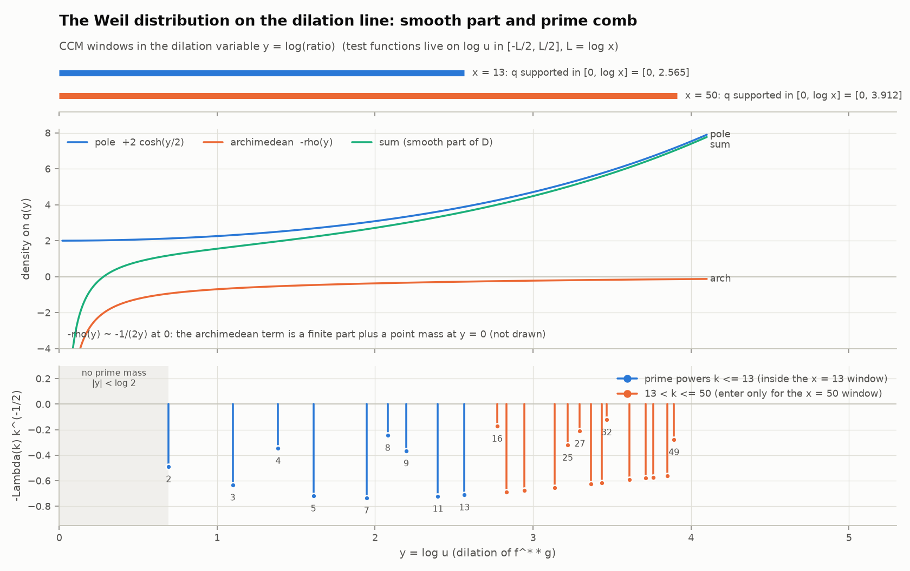

Weil distribution D(y) on y > 0, in the brief's normalisation: Psi(F) = int_0^L q(y) D(y) dy with q(y) = F(y) + F(-y). Top: the CCM windows for x = 13 and x = 50 (q is supported in [0, log x]; the test functions themselves live on log u in [-L/2, L/2]). Middle: the smooth part, pole +2 cosh(y/2) and archimedean -rho(y), drawn separately and summed; the archimedean finite part and point mass at y = 0 are not drawn. Bottom: the prime comb, a point mass -Lambda(k) k^(-1/2) at y = log k, split into the prime powers inside the x = 13 window and those that enter only by x = 50. The grey band |y| < log 2 carries no prime mass.

- Panels: windows (closed form); smooth part of D (closed form, floating point); prime comb (exact weights)
- Kind: closed form
- Data source: `brief.md Conventions`; `notes/zeta-spectral-triples/plan.md section 1`
- Script: `viz/rtp1/step0_objects.py`
- Files: `s0_line.png`, `s0_line.svg`, `s0_line.dark.png`, `s0_line.dark.svg`, `data/s0_line.csv`

### Test functions: the Fourier basis and the lattice bump (`s0_testfns`)

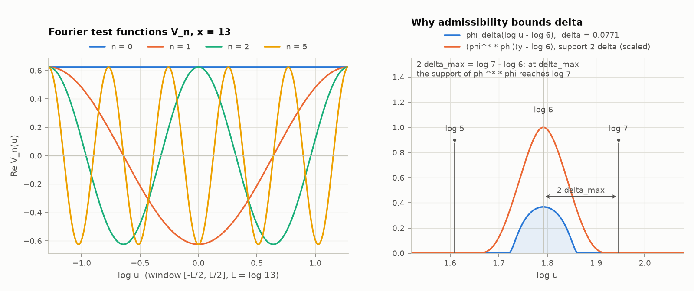

Left: real parts of the Fourier test functions V_n(u) = L^(-1/2) exp(2 pi i n (log u + L/2)/L) on the centred x = 13 window, n = 0, 1, 2, 5. Right: the C_c^infinity bump phi_delta centred at log 6 (the lattice point 2 * 3 of {2,3}, A = 1) with delta = delta_max = 0.07708 from lane A2's admissible table, and its autocorrelation phi^* * phi (scaled to peak 1), supported within 2 delta. At delta_max the support reaches log 7 exactly (2 delta_max = log 7 - log 6); any larger delta lets the foreign prime power 7 into the Gram entry of the ratio 6. log 5 is further away.

- Panels: V_n (closed form); bump and autocorrelation (floating-point quadrature); delta_max from lane A2 (certified)
- Kind: closed form
- Data source: `outputs/rtp1_prime_content.txt (admissible delta table)`
- Script: `viz/rtp1/step0_objects.py`
- Files: `s0_testfns.png`, `s0_testfns.svg`, `s0_testfns.dark.png`, `s0_testfns.dark.svg`, `data/s0_testfns.csv`

### The prime-content lattices on the line (`s0_lattice`)

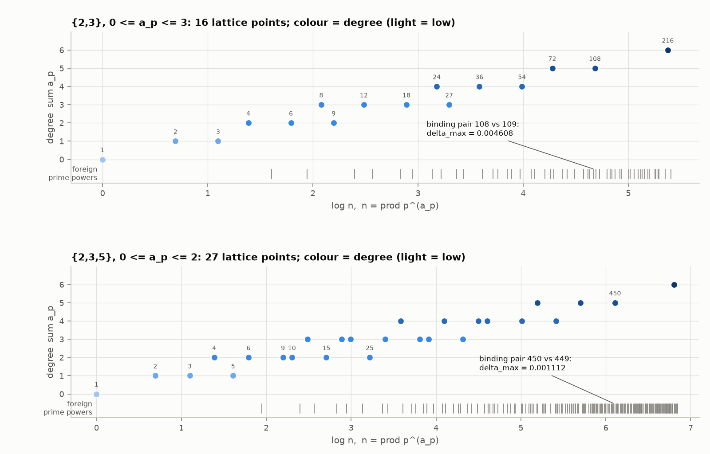

Lattice points log(prod p^(a_p)) of the prime-content channel, one row per degree sum a_p (colour repeats the degree on a one-hue ramp). Top: {2,3}, A <= 3 (16 points). Bottom: {2,3,5}, A <= 2 (27 points; only degree <= 2 and the binding point are labelled). Grey ticks: prime powers not built from the lattice primes (foreign prime powers), up to the largest lattice point. Annotated: the binding pair of lane A2's admissible-delta table (a lattice ratio next to a foreign prime power), which sets delta_max.

- Panels: {2,3} lattice (exact); {2,3,5} lattice (exact); delta_max from lane A2 (certified)
- Kind: exact
- Data source: `outputs/rtp1_prime_content.txt (admissible delta table)`
- Script: `viz/rtp1/step0_objects.py`
- Files: `s0_lattice.png`, `s0_lattice.svg`, `s0_lattice.dark.png`, `s0_lattice.dark.svg`, `data/s0_lattice.csv`

### The convolution picture for a mixed pair (`s0_convolution`)

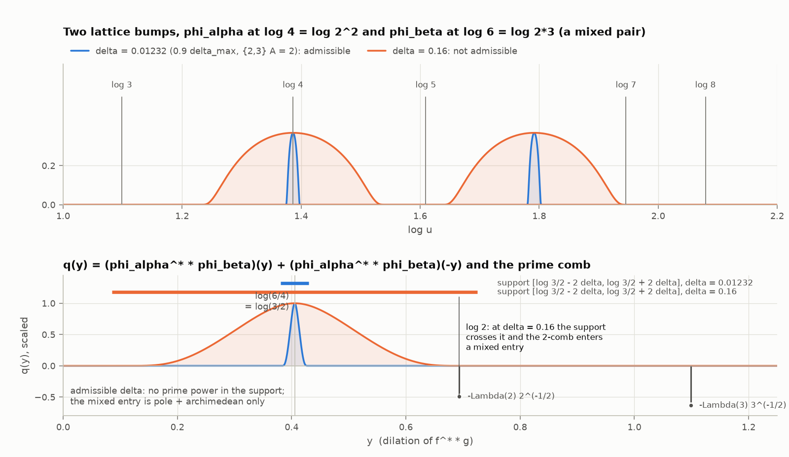

Bumps phi_alpha at log 4 and phi_beta at log 6 (lattice points (2,0) and (1,1) of {2,3}, A = 2, which differ in both coordinates: a mixed entry). phi_alpha^* * phi_beta is supported within 2 delta of log(6/4) = log(3/2) = 0.405. At the admissible delta = 0.01232 (0.9 delta_max of lane A2) the support touches no prime power, so the Gram entry is pole plus archimedean only. At delta = 0.16 the support (half-width 0.32) crosses log 2 = 0.693 and the 2-comb enters a mixed entry: admissibility fails. q is scaled to peak 1 for each delta; comb weights are exact.

- Panels: bumps on the log u line (closed form); q(y) (floating-point autocorrelation) and comb (exact)
- Kind: closed form
- Data source: `outputs/rtp1_prime_content.txt (delta grid)`
- Script: `viz/rtp1/step0_objects.py`
- Files: `s0_convolution.png`, `s0_convolution.svg`, `s0_convolution.dark.png`, `s0_convolution.dark.svg`, `data/s0_convolution.csv`

## Step 1: the dilation channel (lane A1)

Lane A1's certified outputs, plus window matrices and eigenvectors recomputed for display from zst's (a_n, b_n).

### The window matrix tau, x = 13, N = 30 (`s1_window`)

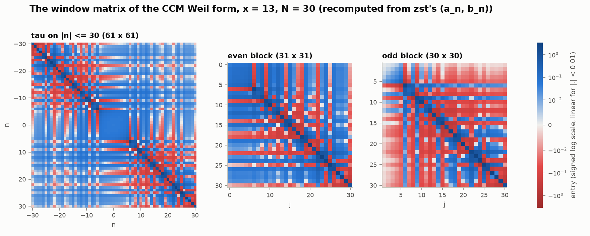

Heat maps of the Loewner window matrix tau_nm = (b_n - b_m)/(n - m), tau_nn = a_n, on |n| <= 30 at x = 13 (left), and of its even block (basis V_0, (V_j + V_-j)/sqrt2) and odd block ((V_j - V_-j)/sqrt2) (zst/src/blocks.c). Blue positive, red negative, signed-log colour scale. Recomputed in floating point for display from zst's certified (a_n, b_n) (zst_riemann_ab at 300 bits, midpoints); the block decomposition is checked against the full matrix. The large diagonal a_n + b_n/n at high n dominates; the minimal even eigenvalue near this N (lane A1, certified: 1.57e-39 at N = 20, 9.46e-54 at N = 40) is invisible at this scale.

- Panels: full tau (recomputed, floating point); even block (recomputed); odd block (recomputed)
- Kind: recomputed (floating point)
- Data source: `zst_riemann_ab (zst/build/libzst.a) via viz/rtp1/bridges.py`
- Script: `viz/rtp1/step1_dilation.py`
- Files: `s1_window.png`, `s1_window.svg`, `s1_window.dark.png`, `s1_window.dark.svg`, `data/s1_window.csv`

### The ground state of the window, x = 13, 25, 50 (`s1_ground`)

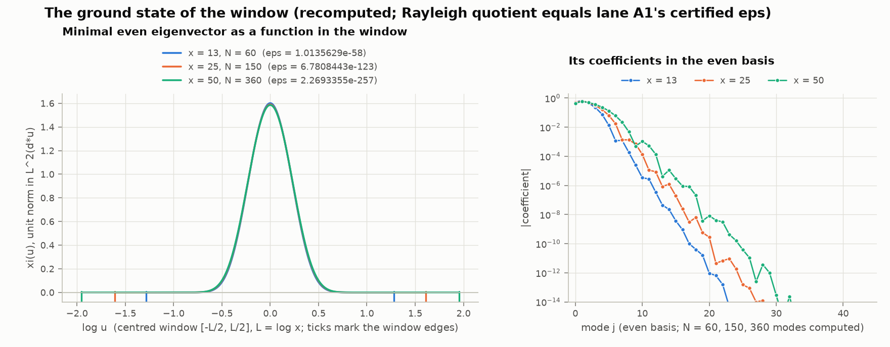

Left: the minimal even eigenvector xi of the window form, drawn as the function sum_j v_j phi_j(log u) on the centred window (phi_0 = L^(-1/2), phi_j = (-1)^j sqrt2 L^(-1/2) cos(2 pi j log u / L); the convention of lane A1's overlap_f), at x = 13, 25, 50 with N = 60, 150, 360 (at or above lane A1's saturation N_sat ~ 1.7 x log x). Right: the absolute coefficients against j/(x log x). Recomputed for display: zst's (a_n, b_n) at 700/1100/1700 bits, zst's even block, inverse iteration in multiprecision midpoint arithmetic; the Rayleigh quotients (1.01e-58, 6.78e-123, 2.27e-257) reproduce lane A1's certified eps_N, which is the check that the eigenvector is the right one. The three functions nearly coincide in log u (lane A1's certified intrinsic overlap between x = 13 and x = 50 at N = 60 is 0.9989): the ground state sits well inside every window and is fixed early. No zeros used.

- Panels: xi as a function (recomputed, multiprecision); coefficients (recomputed)
- Kind: recomputed (multiprecision midpoint)
- Data source: `zst_riemann_ab via viz/rtp1/bridges.py`; `outputs/rtp1_a1_axisN_x13.txt, _x25.txt, _x50.txt (eps check)`
- Script: `viz/rtp1/step1_dilation.py`
- Files: `s1_ground.png`, `s1_ground.svg`, `s1_ground.dark.png`, `s1_ground.dark.svg`, `data/s1_ground.csv`

### Axis N: Delta I_N, its saturation, and the envelope (`s1_axisN`)

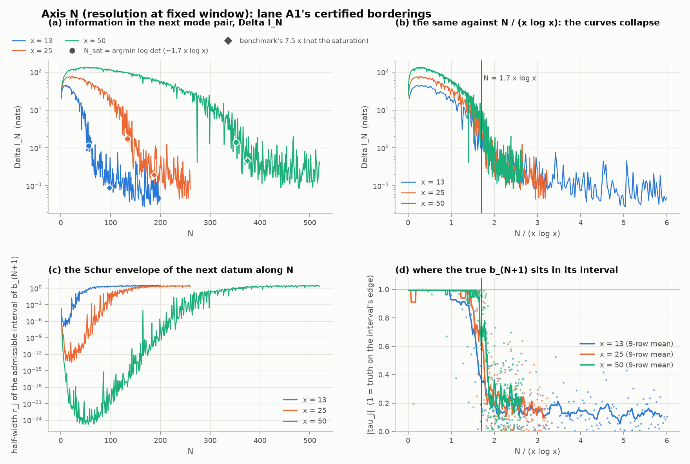

Lane A1.2 at fixed x = 13, 25, 50 (certified ball LDL^T; midpoints plotted). (a) Delta I_N, the log-det gain of the bordering |n| <= N -> N+1 (Gaussian mutual information of the new mode pair with the old ones). Circles: N_sat = argmin log det = 56, 134, 352, i.e. about 1.7 x log x. Diamonds: the benchmark's empirical 7.5 x, which lane A1 finds is not the saturation point (it agrees only near x = 50). (b) The same against N/(x log x): the three curves fall together near 1.7. (c) The half-width r_j of the admissible interval of the next datum b_(N+1) (Lemma A1.1'): tiny below saturation, O(1) above it at every x. (d) The position |tau_j| of the true b_(N+1) in that interval (dots) and its 9-row running mean (lines): on the boundary (|tau| ~ 1, the bordered block is nearly singular) below saturation, interior above.

- Panels: Delta I_N (certified); collapse (certified); r_j (certified); |tau_j| (certified; running mean derived)
- Kind: certified data
- Data source: `outputs/rtp1_a1_axisN_x13.txt`; `outputs/rtp1_a1_axisN_x25.txt`; `outputs/rtp1_a1_axisN_x50.txt`
- Script: `viz/rtp1/step1_dilation.py`
- Files: `s1_axisN.png`, `s1_axisN.svg`, `s1_axisN.dark.png`, `s1_axisN.dark.svg`, `data/s1_axisN.csv`

### Learning curve along x, CCM protocol (`s1_learning_ccm`)

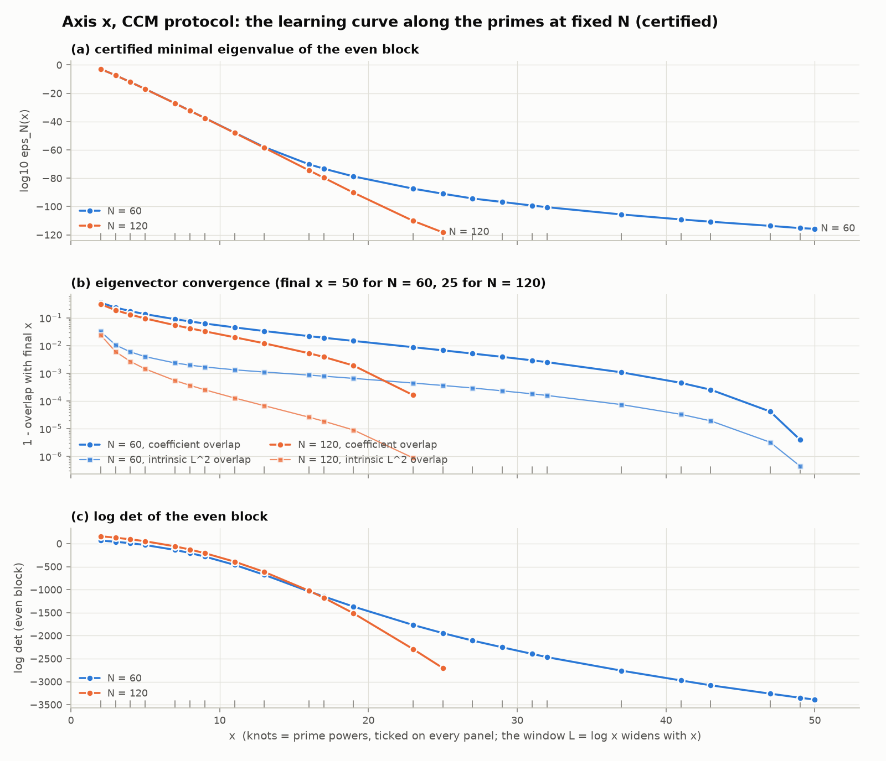

Lane A1.3, CCM protocol: N fixed (60 and 120), x runs through the prime powers, and with it the window L = log x (so every (a_n, b_n) changes between knots; the new prime power enters with weight 0 at x = k). (a) certified eps_N(x), log scale: it falls at 5.0 to 5.3 digits per unit of x (the e^(-4 pi x) law is 5.46) only while N >= N_sat(x) ~ 1.7 x log x, then flattens (N = 60 beyond x ~ 13). (b) 1 - overlap of the minimal eigenvector with the one at the final x: circles use coefficient vectors (window rescaled), squares the intrinsic L^2(d*u) overlap on centred windows. (c) log det of the even block. Every stage is certified positive definite. Ticks: prime powers.

- Panels: eps_N(x) (certified); overlaps (certified); log det (certified)
- Kind: certified data
- Data source: `outputs/rtp1_a1_axisx_ccm_N60.txt`; `outputs/rtp1_a1_axisx_ccm_N120.txt`
- Script: `viz/rtp1/step1_dilation.py`
- Files: `s1_learning_ccm.png`, `s1_learning_ccm.svg`, `s1_learning_ccm.dark.png`, `s1_learning_ccm.dark.svg`, `data/s1_learning_ccm.csv`

### Learning curve along x, fixed-window protocol (`s1_learning_fixedL`)

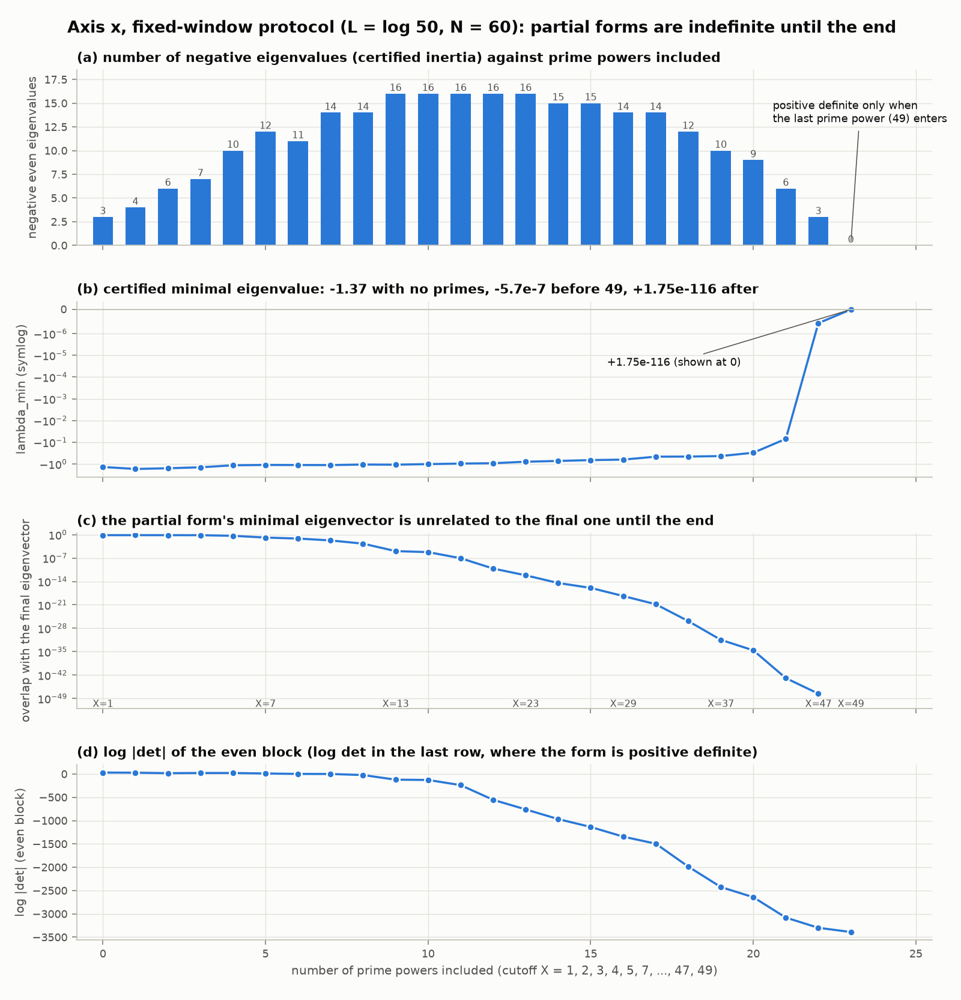

Lane A1.3, fixed-window protocol (a partial-information form, not the CCM form except in its last row): L = log 50 and N = 60 held fixed, prime powers added one at a time. (a) The certified number of negative even eigenvalues against the number of prime powers included: 3 with no primes (pole plus archimedean only), up to 16, and 0 only when the last prime power 49 enters. (b) The certified minimal eigenvalue on a symmetric-log axis (linear below 1e-6): -1.37 with no primes, -5.66e-7 with every prime power except 49, +1.75e-116 at the end. (c) The overlap of the partial form's minimal eigenvector with the final one (2.7e-48 at X = 47). (d) log |det| of the even block. In this protocol the partial forms are not posteriors: the information arrives as a step at the last prime power.

- Panels: negative-eigenvalue count (certified inertia); lambda_min (certified); overlap (certified); log |det| (certified)
- Kind: certified data
- Data source: `outputs/rtp1_a1_axisx_fixedL_N60.txt`
- Script: `viz/rtp1/step1_dilation.py`
- Files: `s1_learning_fixedL.png`, `s1_learning_fixedL.svg`, `s1_learning_fixedL.dark.png`, `s1_learning_fixedL.dark.svg`, `data/s1_learning_fixedL.csv`

### The envelope panel: r_j, eps_N, e^(-4 pi x) and the first-zero error (`s1_envelope`)

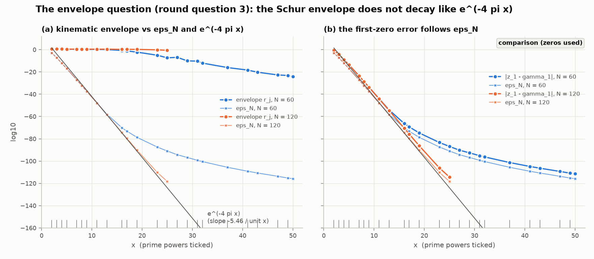

Lane A1's kinematic envelope is the half-width r_j of the admissible interval of the next datum b_(N+1) (the Schur envelope of shard 08g, Lemma A1.1'). (a) Along x in the CCM protocol at N = 60 and 120: r_j (circles) against the certified eps_N (squares) and a reference line of slope e^(-4 pi x) through eps_120(13). r_j shrinks at about 0.7 digits per unit of x at N = 60 and only because N falls below N_sat(x); at saturated N it does not shrink at all (0.5 to 3.7 at x = 13, 25, 50; Step 1 axis-N figure). eps_N follows e^(-4 pi x) while N >= N_sat(x). (b) Comparison (zeros used): the certified bound on |z_1 - gamma_1| from the COMPARISON STEP blocks, against eps_N; the ratio is about 1e4 at every x and N. Lane A1's reading: the e^(-4 pi x) convergence is arithmetic (the residual of a cancellation using every prime power < x), not kinematic.

- Panels: envelope and eps (certified; the reference line is drawn, not fitted); comparison (zeros used): |z_1 - gamma_1| (certified comparison step) and eps_N
- Kind: certified data; panel (b) comparison (zeros used)
- Data source: `outputs/rtp1_a1_axisx_ccm_N60.txt`; `outputs/rtp1_a1_axisx_ccm_N120.txt`
- Script: `viz/rtp1/step1_dilation.py`
- Files: `s1_envelope.png`, `s1_envelope.svg`, `s1_envelope.dark.png`, `s1_envelope.dark.svg`, `data/s1_envelope.csv`

### The posterior of the next datum (Lemma A1.1') (`s1_posterior`)

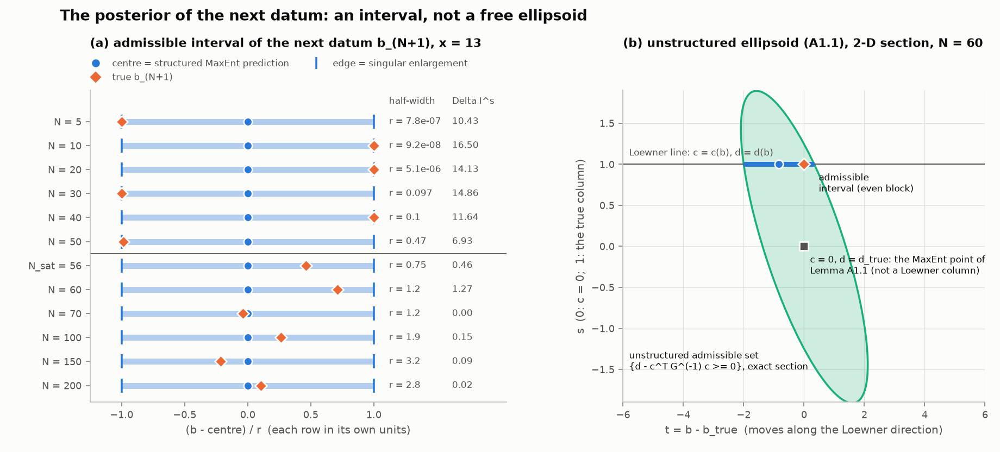

(a) Certified (lane A1, x = 13): for each N, the joint admissible interval of the next datum b_(N+1) given a_(N+1) and the window |n| <= N (Lemma A1.1', the exact analogue of the extension disc of prop:extension-disc), drawn in its own units: centre (circle) = the structured MaxEnt prediction, diamond = the true b_(N+1), edge = the singular enlargement (a bordered block with a kernel). Labels: half-width r_j and the log-det gain Delta I^s of the truth over the MaxEnt prediction. Below N_sat = 56 the truth sits on the edge; above it, inside. (b) Recomputed for display (multiprecision midpoint, x = 13, N = 60, even block): the unconstrained admissible set of Lemma A1.1, {(c, d): d - c^T G^(-1) c >= 0}, cut by the plane through the MaxEnt point (c = 0, d = d_true) that contains the Loewner line of admissible columns. The line crosses the set in the admissible interval; the point c = 0 is not on the line: the unstructured MaxEnt prediction is not a Loewner column (lane A1's correction). The recomputed Schur complement and half-width reproduce the certified s_e and r_e.

- Panels: intervals (certified); unstructured ellipsoid section (recomputed, labelled as such)
- Kind: certified data + recomputed section
- Data source: `outputs/rtp1_a1_axisN_x13.txt`; `zst_riemann_ab via viz/rtp1/bridges.py`
- Script: `viz/rtp1/step1_dilation.py`
- Files: `s1_posterior.png`, `s1_posterior.svg`, `s1_posterior.dark.png`, `s1_posterior.dark.svg`, `data/s1_posterior.csv`

## Step 2: the prime-content channel (lane A2)

Lane A2's Gram matrices and eigenvectors from its own routines, its certified scaling tables, and the labelled explicit-formula comparison.

### Gram matrix of the {2,3} lattice and its mixed entries (`s2_gram`)

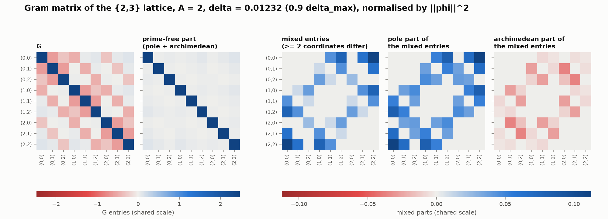

Lane A2's Gram matrix G_(alpha beta) = QW(phi_alpha, phi_beta)/||phi||^2 on {2,3}, A = 2 (lattice points (a, b) = exponents of 2 and 3), at delta = 0.01232 = 0.9 delta_max. Left pair, one scale: G and its prime-free part (pole plus archimedean; the difference is the 2- and 3-combs on the axis-type entries). Right triple, one scale: the mixed entries (lattice points differing in both coordinates), and their pole and archimedean parts, which sum to them exactly: the mixed entries carry no prime term. The pole part is positive and dominates; the archimedean part is negative (lane A2's correction of the note: the cross-place information is pole plus archimedean, pole first). Entries from lane A2's certified routines (arb balls, 200 bits), midpoints plotted; lambda_min 0.76015 matches its table.

- Panels: G; prime-free part; mixed entries; pole part of mixed; archimedean part of mixed
- Kind: certified (lane A2 routines, arb midpoints)
- Data source: `scripts/rtp1_prime_content.py (build)`; `outputs/rtp1_prime_content.txt (lambda_min check)`
- Script: `viz/rtp1/step2_prime_content.py`
- Files: `s2_gram.png`, `s2_gram.svg`, `s2_gram.dark.png`, `s2_gram.dark.svg`, `data/s2_gram.csv`

### Minimal eigenvector on the {2,3} lattice vs the product state (`s2_eigvec_23`)

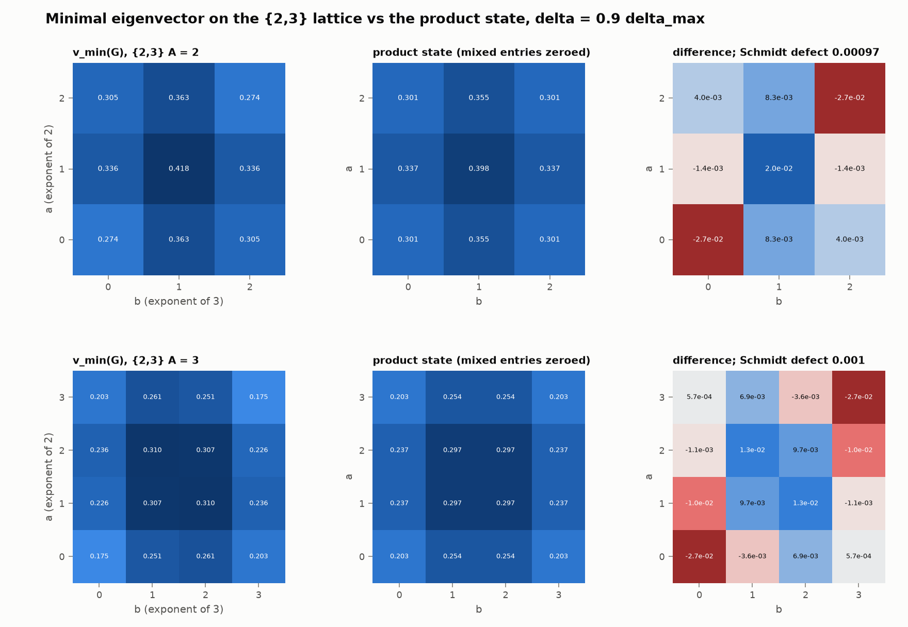

The certified minimal eigenvector of G on the {2,3} lattice (grid a = exponent of 2, b = exponent of 3), for A = 2 (delta = 0.01232) and A = 3 (delta = 0.004147), next to the eigenvector of G with the mixed entries set to zero, which by lane A2's lemma 4.1 is exactly the Kronecker sum of the one-prime forms, so its minimal eigenvector is the product state v_(2) x v_(3) (checked: Schmidt defect < 1e-12). Right: the difference, on its own diverging scale. The inter-place part of the eigenvector is O(delta^2) in the Schmidt defect (9.7e-4 and 1.0e-3 here) and the difference is O(delta). Lane A2 routines, arb midpoints.

- Panels: v_min(G) (certified); product state (certified); difference (derived)
- Kind: certified (lane A2 routines, arb midpoints)
- Data source: `scripts/rtp1_prime_content.py (build, min_eig)`; `outputs/rtp1_prime_content.txt (lambda and Schmidt defect checks)`
- Script: `viz/rtp1/step2_prime_content.py`
- Files: `s2_eigvec_23.png`, `s2_eigvec_23.svg`, `s2_eigvec_23.dark.png`, `s2_eigvec_23.dark.svg`, `data/s2_eigvec_23.csv`

### Minimal eigenvector on the {2,3,5} lattice (three slices) (`s2_eigvec_235`)

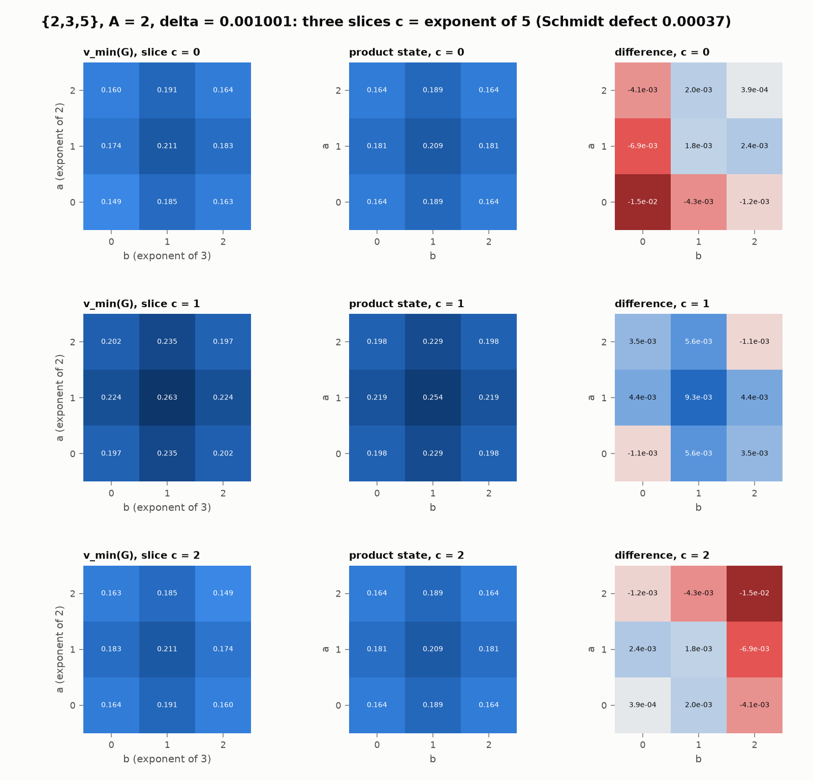

As the previous figure for {2,3,5}, A = 2, delta = 0.001001 (0.9 delta_max): the 27 components shown as three 3 x 3 slices c = 0, 1, 2 (exponent of 5); left the certified minimal eigenvector of G, middle the product state of the Kronecker sum (mixed entries zeroed), right their difference. Schmidt defect 3.7e-4 (lane A2: 3.66e-4).

- Panels: v_min(G) slices (certified); product state slices (certified); difference (derived)
- Kind: certified (lane A2 routines, arb midpoints)
- Data source: `scripts/rtp1_prime_content.py (build, min_eig)`; `outputs/rtp1_prime_content.txt (lambda and Schmidt defect checks)`
- Script: `viz/rtp1/step2_prime_content.py`
- Files: `s2_eigvec_235.png`, `s2_eigvec_235.svg`, `s2_eigvec_235.dark.png`, `s2_eigvec_235.dark.svg`, `data/s2_eigvec_235.csv`

### Scaling of the inter-place effects with delta (`s2_scaling`)

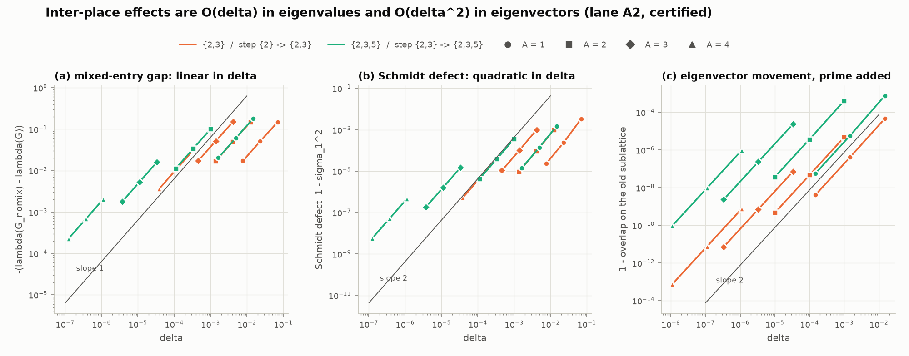

Lane A2's certified measurements at delta = 0.9, 0.3, 0.1 delta_max (panels a, b) and at a common delta_c = 0.9 delta_max({2,3,5}, A), delta_c/10, delta_c/100 (panel c). Colour: prime set (or the step that adds a prime); marker: A. (a) The gap lambda(G_nomix) - lambda(G) (negative: the mixed entries raise lambda_min) is linear in delta; lane A2 plots it as gap/delta converging, here log-log with a slope-1 guide. (b) The Schmidt defect of the minimal eigenvector across the cut {p} | rest, with a slope-2 guide. (c) 1 - overlap between the old eigenvector and the restriction of the new one to the old sublattice, for {2} -> {2,3} and {2,3} -> {2,3,5}: fitted slopes 2.00 to 2.06. Guides are drawn, not fitted.

- Panels: gap_mix (certified); Schmidt defect (certified); eigenvector movement (certified)
- Kind: certified data
- Data source: `outputs/rtp1_prime_content.txt (sections 5b and 6)`
- Script: `viz/rtp1/step2_prime_content.py`
- Files: `s2_scaling.png`, `s2_scaling.svg`, `s2_scaling.dark.png`, `s2_scaling.dark.svg`, `data/s2_scaling.csv`

### Admissible delta_max against A (`s2_deltamax`)

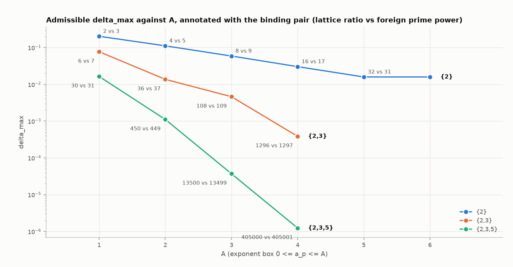

Lane A2's admissible delta_max(S, A) = (1/2) min |log k - log r| over lattice ratios r and prime powers k != r (log scale), for S = {2}, {2,3}, {2,3,5}. Each point is annotated with its binding pair r vs k: a lattice ratio next to a foreign prime power (6 vs 7, 36 vs 37, 108 vs 109, 1296 vs 1297, ..., 405000 vs 405001). delta_max falls roughly like the reciprocal of the largest lattice ratio, which is why the inter-place effects this channel can see are small. {2}, A = 6 repeats the A = 5 value (32 vs 31). Certified balls, radius < 1e-59.

- Panels: delta_max (certified)
- Kind: certified data
- Data source: `outputs/rtp1_prime_content.txt (section 2)`
- Script: `viz/rtp1/step2_prime_content.py`
- Files: `s2_deltamax.png`, `s2_deltamax.svg`, `s2_deltamax.dark.png`, `s2_deltamax.dark.svg`, `data/s2_deltamax.csv`

### Explicit-formula comparison (zeros used) (`s2_explicit`)

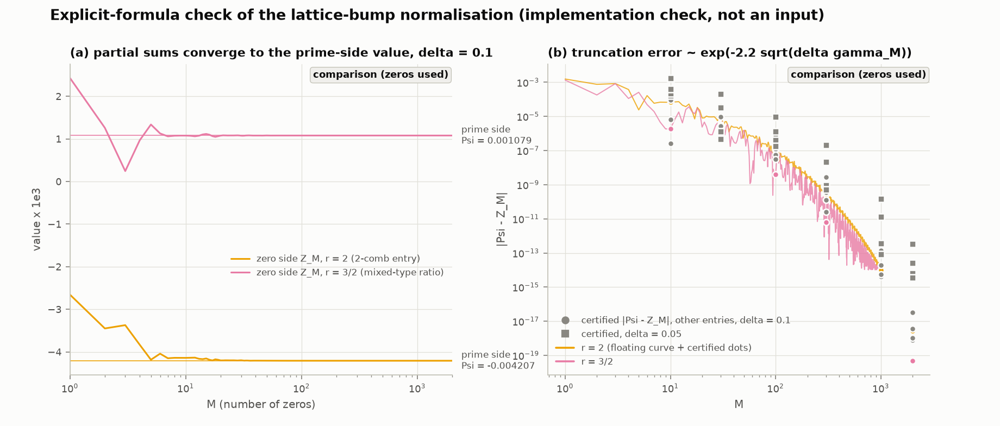

Comparison (zeros used), lane A2.4: an implementation check of the explicit formula in this normalisation, never an input to a form. (a) The zero-side partial sums Z_M = sum_(k<=M) 2 cos(gamma_k D) phihat_delta(gamma_k)^2 for two Gram entries at delta = 0.1 (the ratio r = 2, which carries the 2-comb, and r = 3/2, pole plus archimedean only), against the certified prime-side values Psi from lane A2's output (horizontal lines). The curves are recomputed in floating point (certified zeros from python-flint, Gauss-Legendre transform of the bump) and reproduce the certified errors to their 3 printed digits wherever those exceed 1e-14. (b) |Psi - Z_M|: dots are lane A2's certified values for all ten entries (delta = 0.1 circles, 0.05 squares), lines the floating curves (drawn down to 1e-14, the floating-point floor). The error decays like exp(-2.2 sqrt(delta gamma_M)) (lane A2's fit).

- Panels: comparison (zeros used): partial sums (floating) vs certified Psi; comparison (zeros used): certified truncation errors + floating curves
- Kind: comparison (zeros used)
- Data source: `outputs/rtp1_prime_content.txt (section 7)`; `python-flint acb.zeta_zeros`
- Script: `viz/rtp1/step2_prime_content.py`
- Files: `s2_explicit.png`, `s2_explicit.svg`, `s2_explicit.dark.png`, `s2_explicit.dark.svg`, `data/s2_explicit.csv`

## Step 3: short-range positivity (lane B1)

The Weil distribution near the origin and the form value of a bump, with lane B1's statements of Yoshida and Bombieri.

### Short-range positivity (`s3_short_range`)

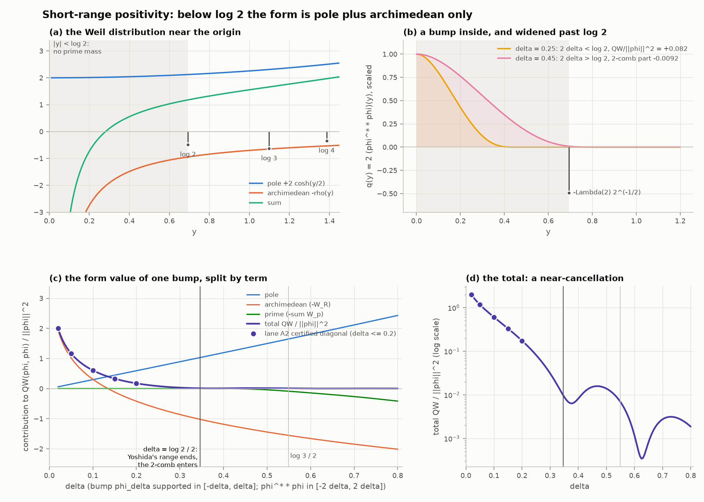

Statements as lane B1 reports them (notes/rtp-round-1/lane-B1.md sections 1-2, byte-cited there): Yoshida 1992, Theorem 1 (k = Q, a = log 2 / 2): <phi, phi> = T_Q(phi * phi~) >= 0 for every smooth phi supported in [-a, a], with equality only for phi = 0; unconditional and computer-assisted. On that space the prime sum vanishes, so the theorem is about the pole plus archimedean form; beyond width log 2 nothing is proved. Bombieri 2000, Theorem 12: for F supported in an interval of length |I| < log 2, T[F * F(-x)-bar] >= (log(1/|I|) - log^+ log(1/|I|) - O(1)) ||F||^2, with the O(1) unspecified, so it gives positivity only for |I| small enough; the log 2 range is Yoshida's. The archimedean term alone is not positive on this space (lane B1: for the even box of width log 2 the archimedean part is -1.217, the pole part +1.400). Figure: (a) the Weil distribution near y = 0 (pole, archimedean, their sum; grey: |y| < log 2, where the prime comb has no mass). (b) q(y) = 2 (phi_delta^* * phi_delta)(y) for the bump at delta = 0.25 (support of q inside log 2; its normalised form value is positive) and widened to delta = 0.45 (support past log 2: the 2-comb enters with weight R_delta(log 2)). (c) The normalised form value of one centred bump against delta, split into its pole, archimedean and prime parts. The prime part is zero up to delta = log 2 / 2, where Yoshida's range ends (vertical line; the second line is log 3 / 2, where the 3-comb enters). The archimedean part carries the logarithmic self-energy: positive for small delta, negative past delta ~ 0.135, and it nearly cancels the growing pole part. (d) The total on a log scale: it grows like -log delta as delta -> 0 (lane A2: d = -log delta - 1.9555 + O(delta)), the growth of Bombieri's lower bound, and it falls to 9.7e-03 at log 2 / 2 and to 3.4e-04 near delta = 0.625 while staying positive for this one bump. One test function only: a positive value here is a single diagonal entry, not a theorem. Curves: floating point; dots: lane A2's certified values.

- Panels: Weil distribution near 0 (closed form); q for two widths (floating point); form value split by term (floating point; certified dots from lane A2); total, log scale (floating point; certified dots)
- Kind: closed form + floating point; certified check points
- Data source: `notes/rtp-round-1/lane-B1.md (statements)`; `scripts/rtp1_prime_content.py (entry, certified dots)`
- Script: `viz/rtp1/step3_short_range.py`
- Files: `s3_short_range.png`, `s3_short_range.svg`, `s3_short_range.dark.png`, `s3_short_range.dark.svg`, `data/s3_short_range.csv`

## Step 4: the kinematic commutant (lane B2)

Lane B2.1's certified dimension counts, prediction tables and lattice box, and the positive set of prime data drawn as exact planar sections (geometry recomputed for display from zst's data).

### Dimension counts of the kinematic conditions (`s4_dimensions`)

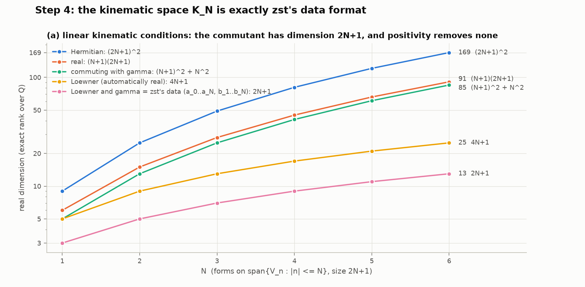

Lane B2.1(a), certified (exact ranks over Q for N = 1..6, each equal to its closed form). Real dimension of the Hermitian forms on the span of V_n, |n| <= N, under the linear kinematic conditions: reality, commuting with the Weyl element gamma, and the Loewner condition [D, H] = |beta><eta| - |eta><beta| (eta = sum V_n fixed). A Loewner form is automatically real (Loewner + real = Loewner, 4N+1; also Hermitian + gamma + real = (N+1)^2, in the table), and Loewner + gamma has dimension 2N+1: exactly the data (a_0..a_N, b_1..b_N). The identity is an interior point of the positive cone, so positivity removes no dimension.

- Panels: dimension against N, five spaces (certified)
- Kind: certified data
- Data source: `outputs/rtp1_commutant.txt`
- Script: `viz/rtp1/step4_commutant.py`
- Files: `s4_dimensions.png`, `s4_dimensions.svg`, `s4_dimensions.dark.png`, `s4_dimensions.dark.svg`, `data/s4_dimensions.csv`

### The positive set of prime data, x = 13, N = 20 (`s4_positive_set`)

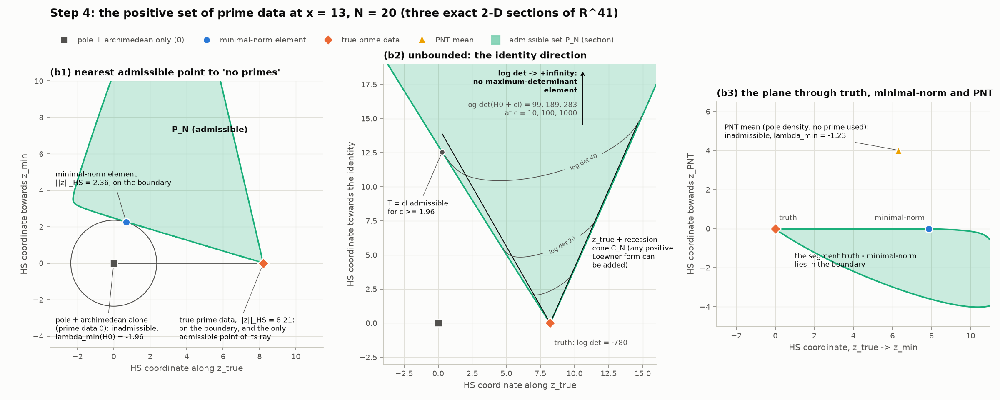

Lane B2.1(b). P_N = {z : H0 + T(z) >= 0}: z = (u_0..u_20, v_1..v_20) the prime part of the Loewner data, H0 the pole + archimedean form (fixed). Recomputed for display: three exact planar sections of this 41-dimensional set, in Hilbert-Schmidt coordinates (so distances are true), evaluated on a grid in double from zst's data (x = 13, cutoff X = 1 and 13); the minimal-norm and PNT points are lane B2's printed coefficient vectors (4 decimals, so the minimal-norm point sits within 1e-4 of the boundary). (b1) The plane through 0 (no prime data: inadmissible), the truth and the minimal-norm element: the circle of radius 2.36 about 0 touches P_N at the minimal-norm element; the truth is a corner, the only admissible point on its own ray (B2: admissible multiples within 1 - 5.7e-36 .. 1 + 2.0e-38). (b2) The plane through 0, the truth and the identity: P_N contains z_true + C_N (the recession cone, drawn from the truth) and log det grows without bound along it, so no maximum-determinant element exists. (b3) The plane through the truth, the minimal-norm element and the PNT mean (the pole's density, inadmissible). Annotated numbers are lane B2's certified values.

- Panels: (b1) section through 0, truth, minimal-norm (recomputed geometry); (b2) section through 0, truth, identity; log-det contours (recomputed geometry); (b3) section through truth, minimal-norm, PNT (recomputed geometry)
- Kind: recomputed for display (geometry); marked points and annotations from lane B2's output
- Data source: `outputs/rtp1_commutant.txt`; `zst (zst_riemann_ab via viz/rtp1/bridges.py)`
- Script: `viz/rtp1/step4_commutant.py`
- Files: `s4_positive_set.png`, `s4_positive_set.svg`, `s4_positive_set.dark.png`, `s4_positive_set.dark.svg`, `data/s4_positive_set.csv`

### The weight box with the lattice known (`s4_lattice_box`)

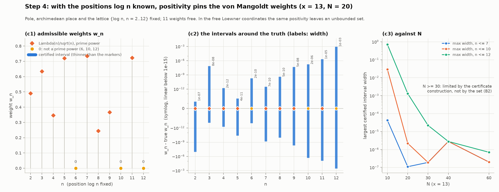

Lane B2.1(d), certified outer bounds (LP duals re-verified at 100 digits). With the pole, the archimedean place and the possible positions log n, n = 2..12, fixed and the 11 weights w_n free, Weil positivity of the x = 13 window (N = 20) confines each weight to the drawn interval around Lambda(n)/sqrt(n), including the zero weights at the non-prime-powers 6, 10, 12. (c1) weights on their natural scale: the intervals are thinner than the markers. (c2) the intervals as deviations from the truth on a symmetric-log axis, labelled with their widths (1e-12 at n = 4 to 1.3e-3 at n = 12). (c3) the largest width over n <= 7, 10, 12 against N; for N >= 30 the widths are limited by lane B2's certificate construction, not by the set. The same positivity in the free Loewner coordinates leaves an unbounded set (Step 4 positive-set figure).

- Panels: weights and intervals (certified); deviation intervals, symlog (certified); widths against N (certified)
- Kind: certified data
- Data source: `outputs/rtp1_commutant.txt`
- Script: `viz/rtp1/step4_commutant.py`
- Files: `s4_lattice_box.png`, `s4_lattice_box.svg`, `s4_lattice_box.dark.png`, `s4_lattice_box.dark.svg`, `data/s4_lattice_box.csv`

### Captured fraction of the true prime data (`s4_capture`)

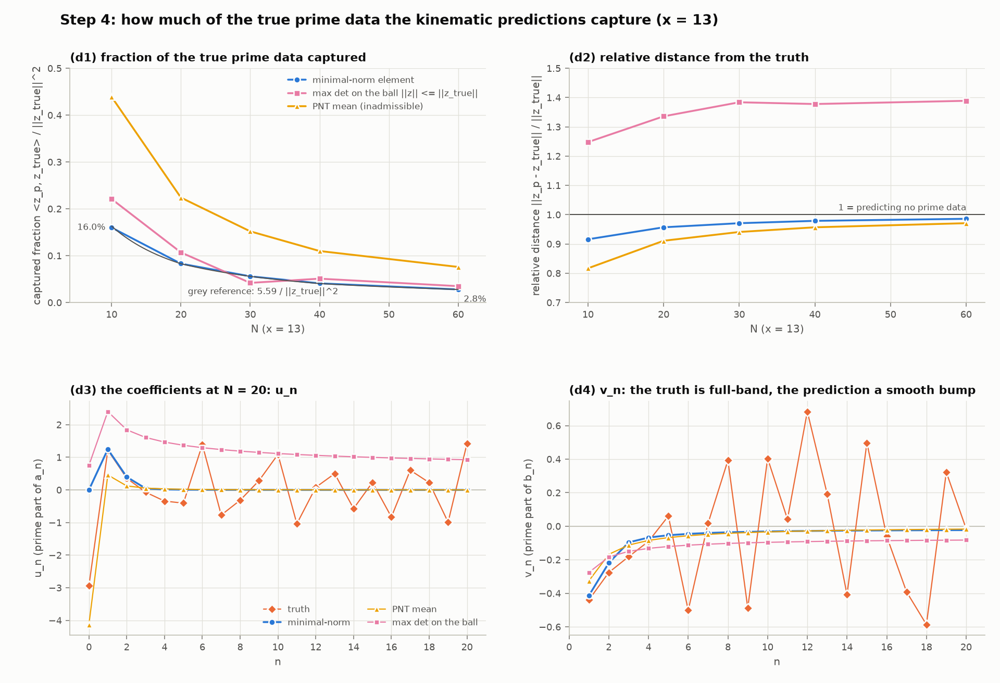

Lane B2.1(c), certified (x = 13; Hilbert-Schmidt inner product on the window). (d1) Fraction of the true prime contribution captured by each prediction against N: the minimal-norm element captures 16%, 8.3%, 5.6%, 4.1%, 2.8% at N = 10, 20, 30, 40, 60. The grey curve is 5.59 / ||z_true||^2, derived from B2's columns: the correction positivity demands is fixed (norm about 2.37) while the truth's norm grows. (d2) Relative distance from the truth; the ball-relaxed maximum-determinant element is farther than predicting no prime data (1.25 to 1.39). (d3, d4) B2's coefficient table at N = 20: the minimal-norm prediction matches (u_1, u_2, v_1, v_2) to about 6%, misses u_0 (0 against -2.94) and is a smooth decaying tail where the true data are O(1) at every n; the ball max-det element raises every u_n by about 1 ("add the identity").

- Panels: captured fraction against N (certified; reference curve derived); relative distance (certified); u_n at N = 20 (certified); v_n at N = 20 (certified)
- Kind: certified data
- Data source: `outputs/rtp1_commutant.txt`
- Script: `viz/rtp1/step4_commutant.py`
- Files: `s4_capture.png`, `s4_capture.svg`, `s4_capture.dark.png`, `s4_capture.dark.svg`, `data/s4_capture.csv`

## Step 5: the calibration case (lane B2)

Lane B2.2's certified Ramanujan cubic graph G40 (78 atoms) next to lane A1's zeta curves: learning, the disc of the next datum, fixed-window inertia, and the graph prime number theorem. No spectral data of the graph is used.

### Learning curves: G40 against zeta (`s5_learning`)

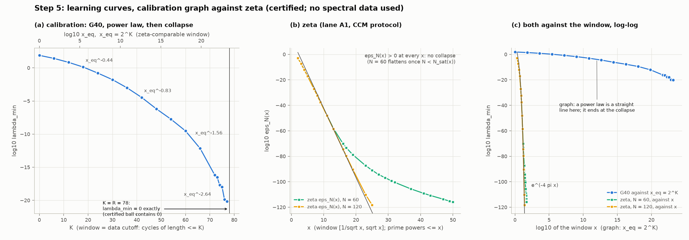

Certified, lanes B2.2 and A1. (a) The certified Ramanujan cubic graph G40 (40 vertices, q = 2, R = 78 distinct atoms): lambda_min of the Toeplitz window form T_K against K, which is at once the window and the data cutoff (the analogue of lane A1's CCM axis x), at the rows lane B2 prints (every sixth K and K = 73..77). The top axis is the zeta-comparable window x_eq = 2^K. The curve is a power law in x_eq whose exponent steepens (lane B2's fitted exponents 0.44, 0.83, 1.56, 2.64 on K = 6..30, 30..54, 54..72, 72..77) and then collapses: lambda_min(T_78) = 0, a certified ball of radius 3.7e-175 containing 0. (b) Zeta, lane A1's certified eps_N(x) in the CCM protocol at N = 60 and 120, with an e^(-4 pi x) reference line through eps_120(13) (drawn, not fitted): positive at every x, no collapse. (c) Both against log10 of the window: the graph's power law is a straight line over 23 decades of x_eq; zeta falls 118 decades between x = 2 and 25. The two forms are normalised differently (graph nu_0 = 78, zeta O(1)); compare shapes, not heights.

- Panels: G40 lambda_min against K and x_eq (certified); zeta eps_N(x) (certified; reference line drawn); both against log10 window (certified)
- Kind: certified data
- Data source: `outputs/rtp1_calibration.txt`; `outputs/rtp1_a1_axisx_ccm_N60.txt`; `outputs/rtp1_a1_axisx_ccm_N120.txt`
- Script: `viz/rtp1/step5_calibration.py`
- Files: `s5_learning.png`, `s5_learning.svg`, `s5_learning.dark.png`, `s5_learning.dark.svg`, `data/s5_learning.csv`

### The disc of the next datum: G40 against zeta (`s5_disc`)

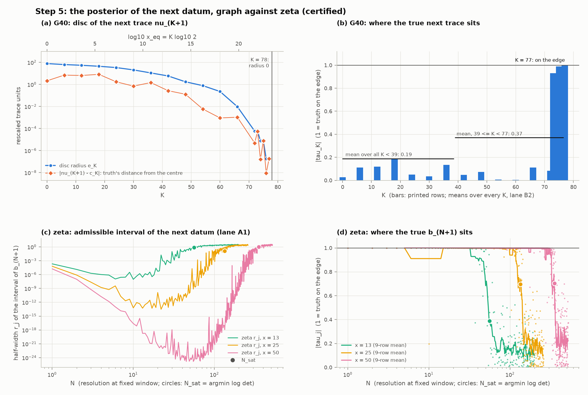

Certified, lanes B2.2 and A1. (a) G40: the radius e_K = det T_K / det T_(K-1) of the disc of the next rescaled trace nu_(K+1) (prop:extension-disc; for Toeplitz data the disc is already the structured section), and the true trace's distance from the disc centre (the Levinson / MaxEnt prediction), |tau_K| e_K from lane B2's printed columns (checked against |nu_(K+1) - c_K| where the printed digits resolve it). The radius falls from nu_0 = 78 to 1.8e-7 and is 0 at K = 78. (b) The position |tau_K| of the truth in its disc at the printed rows, with lane B2's means over every K: interior until K = 77, on the edge there. (c) Zeta: the half-width r_j of the admissible interval of the next datum b_(N+1) against N at x = 13, 25, 50 (lane A1.2; circles N_sat): tiny below saturation, O(1) above it. (d) Zeta: |tau_j| (dots) and its 9-row running mean: on the edge below N_sat, interior above. The graph has no resolution axis; its analogue of N_sat is the collapse at K = R.

- Panels: G40 disc radius and truth's distance (certified; distance derived); G40 |tau_K| (certified); zeta r_j (certified); zeta |tau_j| (certified; running mean derived)
- Kind: certified data
- Data source: `outputs/rtp1_calibration.txt`; `outputs/rtp1_a1_axisN_x13.txt`; `outputs/rtp1_a1_axisN_x25.txt`; `outputs/rtp1_a1_axisN_x50.txt`
- Script: `viz/rtp1/step5_calibration.py`
- Files: `s5_disc.png`, `s5_disc.svg`, `s5_disc.dark.png`, `s5_disc.dark.svg`, `data/s5_disc.csv`

### Fixed-window inertia: G40 against zeta (`s5_inertia`)

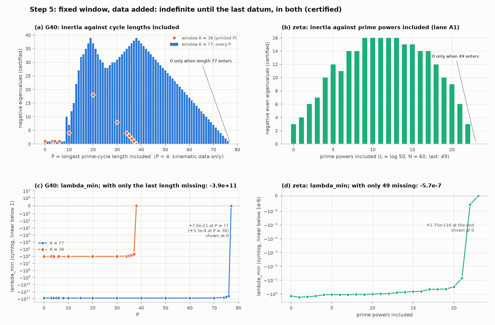

Certified, lanes B2.2 (G40, section 4) and A1.3 (zeta, fixed-window protocol). (a) G40, window K = 77: the certified number of negative eigenvalues of the partial form built from the kinematic data and the prime cycles of length <= P, for every P (bars), and at the printed P for window K = 38 (diamonds). One negative direction (the pole) with kinematic data only, up to 39, then exactly one fewer per added length over the last 39, and 0 only when the last length enters. (b) Zeta, L = log 50, N = 60: the negative even eigenvalues against prime powers included: 3 with none, up to 16, 0 only when 49 enters. (c, d) The certified lambda_min on symmetric-log axes. With only the last datum missing it is -3.9e11 for the graph (the lag-K corner of a Toeplitz form carries full weight) against -5.7e-7 for zeta (the prime power at the window edge enters with weight 1 - log k / L -> 0): lane B2 reads the difference as a continuous-versus-discrete edge effect, not arithmetic.

- Panels: G40 negative counts (certified); zeta negative counts (certified); G40 lambda_min (certified); zeta lambda_min (certified)
- Kind: certified data
- Data source: `outputs/rtp1_calibration.txt`; `outputs/rtp1_a1_axisx_fixedL_N60.txt`
- Script: `viz/rtp1/step5_calibration.py`
- Files: `s5_inertia.png`, `s5_inertia.svg`, `s5_inertia.dark.png`, `s5_inertia.dark.svg`, `data/s5_inertia.csv`

### The graph PNT against the truth (`s5_pnt`)

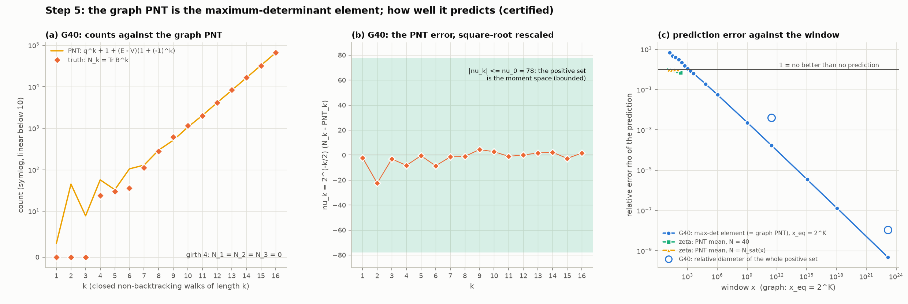

Lane B2.2 section 6b. With G40's kinematic data fixed, the positive set of prime data is the moment space (bounded) and its maximum-determinant element is nu = (nu_0, 0, .., 0), i.e. the graph prime number theorem N_k = q^k + 1 + (E - V)(1 + (-1)^k). (a) The true counts N_k = Tr B^k against that prediction for k <= 16, and (b) the rescaled error nu_k, inside the band |nu_k| <= nu_0 = 78; both derived exactly from lane B2's printed prime-cycle counts pi(l), l <= 16 (checked against its printed nu_(K+1) and rho(K)). (c) Certified: the relative error rho of the prediction against the window, for G40 (x_eq = 2^K) and for zeta's PNT mean (x = 13..200 at N = 40 and at N = N_sat(x); lane B2 section 5b). At comparable windows (x_eq = 16..256) the graph PNT is worse than no prediction (rho = 6.7 .. 2.2); it reaches 4.7e-10 at K = 77, where the whole positive set has relative diameter <= 1.1e-08 (open circles: K = 38 and 77). Zeta's positive set in Loewner coordinates has no maximum-determinant element (Step 4).

- Panels: G40 counts vs PNT (derived exactly from certified pi(l)); G40 rescaled error (derived); rho against the window (certified)
- Kind: certified data (panels a, b derived exactly from printed counts)
- Data source: `outputs/rtp1_calibration.txt`; `outputs/rtp1_commutant.txt`
- Script: `viz/rtp1/step5_calibration.py`
- Files: `s5_pnt.png`, `s5_pnt.svg`, `s5_pnt.dark.png`, `s5_pnt.dark.svg`, `data/s5_pnt.csv`

## Step 7: the contradiction pathway and MaxEnt

From notes/metric-tomography/metric-as-state.md section 7: the extension disc as the Schur algorithm proceeds, and the off-line pair as a saddle.

### The extension disc as the Schur algorithm proceeds (`s7_disc`)

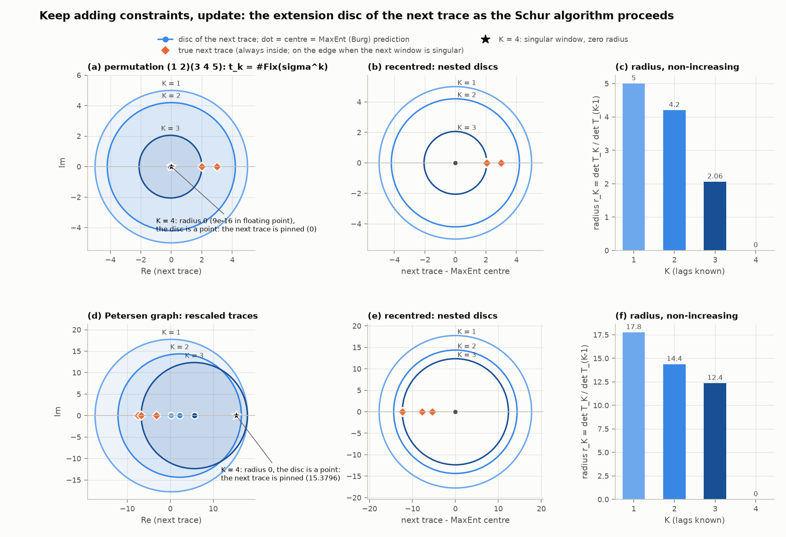

prop:extension-disc (shard 08g) for the two explicit examples of scripts/weil_window_extension.py, computed with that script's own disc and levinson_centre functions. Given the Toeplitz window up to lag K, the admissible next trace t_(K+1) is a closed disc in the complex plane; its centre is the Levinson one-step predictor, i.e. Burg's maximum-entropy extension (the MaxEnt prediction of metric-as-state.md 7.3), and its radius r_K = det T_K / det T_(K-1) does not increase. (a, d) Discs for K = 1, 2, 3 in place, with the true next trace (diamond). (b, e) The same discs recentred on their MaxEnt centres: nested, with the truth inside each. (c, f) The radius. Both examples have four distinct atoms, so T_4 is singular: at K = 3 the truth sits on the boundary of the disc, and at K = 4 the disc has radius 0 and pins the next trace. Upper row: the permutation (1 2)(3 4 5) (t_k = number of fixed points of sigma^k). Lower row: the Petersen graph, rescaled retained traces. Exact data, floating point.

- Panels: discs in place; recentred (nested); radius
- Kind: exact examples (floating point)
- Data source: `scripts/weil_window_extension.py (disc, levinson_centre, toeplitz)`
- Script: `viz/rtp1/step7_maxent.py`
- Files: `s7_disc.png`, `s7_disc.svg`, `s7_disc.dark.png`, `s7_disc.dark.svg`, `data/s7_disc.csv`

### The off-line pair cartoon: bowl versus saddle (`s7_saddle`)

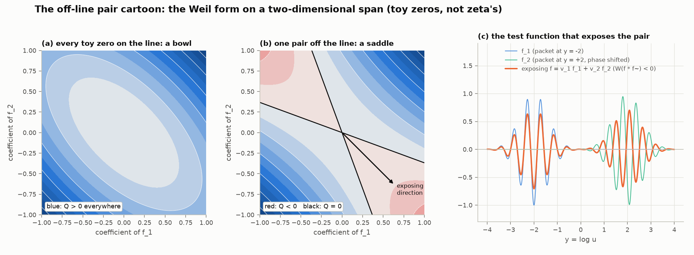

A cartoon of metric-as-state.md 7.2 and 7.4. A toy zero set with invented ordinates 6, 11, 15 (not zeros of zeta) defines W_toy(f * f~) = sum_rho f^(rho) conj f^(1 - rho-bar), f^(s) = int f(y) e^((s - 1/2) y) dy. On the span of two Gaussian wave packets f_1, f_2 (width 0.6, frequency 11, centred at y = -2 and +2, phase offset arccos 0.6) the form is the quadratic Q(s, t) = W((s f_1 + t f_2) * (s f_1 + t f_2)~). (a) All toy zeros on the line: each zero adds |f^(rho)|^2 >= 0 and Q is a bowl. (b) The pair at ordinate 11 moved to 1/2 +- 0.4: it contributes an indefinite 2 x 2 block, here with off-diagonal entry proportional to cosh(0.4 * 4) cos(phase offset) > 1, and Q becomes a saddle (black: Q = 0). (c) The test function along the negative eigenvector: the finite, checkable certificate of a violation. The pair is invisible to test functions whose transforms vanish at it; here the two packets are separated in log u, which is what makes the factors e^(+-beta y) differ. Exact closed forms (Gaussian transforms), floating point.

- Panels: bowl; saddle; exposing test function
- Kind: toy model (closed form)
- Data source: `notes/metric-tomography/metric-as-state.md section 7`
- Script: `viz/rtp1/step7_maxent.py`
- Files: `s7_saddle.png`, `s7_saddle.svg`, `s7_saddle.dark.png`, `s7_saddle.dark.svg`, `data/s7_saddle.csv`
