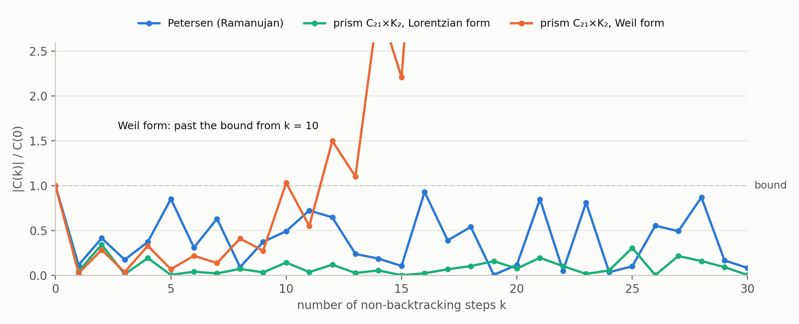

# The GKP reading tested on a Ramanujan graph

Author: `claude:fable-5.1`, 2026-10-05, at TJO's request ("find the analogous constructions for a simpler example satisfying RH: ... a simple ramanujan graph and ihara zeta. Please identify the GKP state for that setting ... Does the analogy hold? Does it break?"). Status: **a record, not a round.** Nothing is registered in `db/claims.tsv`; no REFUTE review has run; no shard. Statement statuses are in the table near the end. Companion to `adelic-gkp.md`. "The previous page" is `weil-positivity-spectroscopy.md`. Checks: `checks/check_graph_gkp.py`, output `checks/output_graph_gkp.txt`.

**Verdict.** The analogy breaks at the first step and holds from the second step on.

- **It breaks at the code.** A graph has no additive lattice like $\mathbb Q\subset\mathbb A$, so there is no GKP comb whose overlaps give the Ihara zeta. The only lattice a graph has is its fundamental group inside the automorphisms of the tree, and that is the analogue of the primes, not of the code.
- **It holds for everything after.** The graph hands you directly what has to be constructed for $\zeta$: the space of lines, with the squeeze step acting on it. On that space the step is a Gaussian circuit made of the three gates of the GKP story: squeeze every vertex mode by $\sqrt q$, apply a Hadamard to every mode, apply a CZ along every edge. The Weil form is the conserved energy of this circuit, and **Weil positivity is the statement that the circuit is stable, which is $A^2\le 4q$ on the non-uniform modes, the Ramanujan property.**
- **One sign flips.** The lines of a graph are bright (resonances of a cavity), where the lines of $\zeta$ are dark (what a code lacks). For $K_4$ the two are complementary in an exact formula (§3).

Notation: $X$ is a connected $(q+1)$-regular graph with $n$ vertices and adjacency matrix $A$; $B$ is the non-backtracking (Hashimoto) operator on directed edges; $N_k=\mathrm{Tr}\,B^k$ counts closed walks of length $k$ with no backtracking, also at the closing step. The examples are $K_4$, the Petersen graph, the cube and $K_5$ (all Ramanujan), and the prism $C_{21}\times K_2$ (not Ramanujan).

## 1. Step by step

| step | adelic GKP code and $\zeta$ | graph and Ihara zeta | verdict |
|---|---|---|---|
| the code | comb on the additive lattice $\mathbb Q\subset\mathbb A$, a Lagrangian in a phase space | no additive lattice; only $\pi_1(X)$ acting on the tree | **breaks** |
| the squeeze | $D_\lambda$ on one adelic mode | one non-backtracking step; a Gaussian circuit on $n$ modes | holds |
| functional equation | Hadamard: $F D_\lambda F^{-1}=D_{1/\lambda}$ | the step is symplectic; the same relation sits inside it | holds |
| the lines | zeros of the code's filter: dark | eigenvalues of the step: bright | **sign flips** |
| explicit formula | zero modes $-$ primes $+$ real place | $-$ trivial pair $+$ cycles $+$ tree | holds, signs flipped |
| smooth background | the real place, $\theta'(E)/\pi$ | the tree's own spectral density (Kesten–McKay) | holds; no place of a graph resembles the real place |
| Weil form | evaluation form on the dark space | explicit matrix $\begin{pmatrix}q&A/2\\A/2&1\end{pmatrix}$ | holds, and is explicit |
| Weil positivity | RH | $A^2\le4q$ off the uniform mode | holds |
| the allowed gain–loss pair | the two zero modes, rates $\pm\tfrac12$ | the uniform mode, $w=q^{\pm1/2}$ | holds exactly |
| a violation | hypothetical | real: the prism $C_{21}\times K_2$ | holds, and can be watched |
| the line space | has to be constructed | given from the start | **differs** |
| source of positivity | unknown | none that is uniform across graphs | no help |

## 2. Is there a code? Three partial answers

**(a) The lattice in the tree gives a comb, but not a GKP comb.** The universal cover of $X$ is the $(q+1)$-regular tree $T$, and $X=\Gamma\backslash T$ with $\Gamma=\pi_1(X)$ a free group. This is the analogue of the circle as $\mathbb Z\backslash\mathbb R$, and the comb is the $\Gamma$-orbit of a point. But:

- $T$ is a configuration space, not a phase space, and $\Gamma$ is a free non-abelian group. The comb is fixed by translations only; there are no modulations, no dual lattice and no Hadamard.
- Its teeth are closed walks, so summing over it gives $N_k$, which is the level of $\zeta'/\zeta$ (the explicit formula), not the level of $\zeta$. It is the analogue of the lattice $\mathbb Q^\times$ acting on adele classes, where the closed orbits are the primes.

**(b) For $q=p$ an odd prime, the tree itself is made of GKP states.** A self-dual lattice in the $p$-adic phase space $\mathbb Q_p^2$ is the stabiliser of one $p$-adic qunaught, and these lattices are the vertices of one colour in the Bruhat–Tits tree of $\mathrm{PGL}_2(\mathbb Q_p)$. The vertices of the other colour are lattices $M$ with $[M^\perp:M]=p^2$, which are GKP codes of one $p$-dimensional qudit (Proposition 5 of the note with $a+b=1$). A qunaught is joined to a code when its state lies in the code space. So:

- each qudit code has $p+1$ neighbours, its $p+1$ stabiliser axes, and these are mutually unbiased (check H10 for $p=3,5,7$);
- two qunaughts $2k$ steps apart have overlap $p^{-k/2}$, for example $\langle1_{\mathbb Z_p},D_{p^k}1_{\mathbb Z_p}\rangle=p^{-k/2}$.

An arithmetic graph such as an LPS graph is this tree divided by a discrete group of $p$-adic Cliffords. A general graph is the tree divided by a subgroup of $\mathrm{Aut}(T)$, which is far larger and need not consist of Cliffords. The lattice facts are standard; the reading is mine. For $q=2$, which covers $K_4$ and Petersen, the 2-adic vacuum has a smaller stabiliser (note §5) and I have not worked out the dictionary.

An observation, not a derivation: $p^{-k/2}$ is also the weight of the kicks of the prime $p$ in the explicit formula for $\zeta$.

**(c) For $K_4$ there is a genuine GKP code with the same lines, and it is a curve.** See §3.

## 3. The simplest example: $K_4$

$K_4$ is 3-regular, so $q=2$. Its adjacency eigenvalues are $3,-1,-1,-1$. The non-uniform lines are $w=e^{\pm i\theta}$ with $\cos\theta=-1/(2\sqrt2)$, $\theta\approx110.7°$, each three times, and the echo is $C(k)=6\cos k\theta$.

| $k$ | 1 | 2 | 3 | 4 | 5 | 6 | 7 | 8 |
|---|---|---|---|---|---|---|---|---|
| closed walks $N_k$ | 0 | 0 | 24 | 24 | 0 | 96 | 168 | 168 |
| prime cycles of length $k$ | 0 | 0 | 8 | 6 | 0 | 12 | 24 | 18 |
| points of $E$ over $\mathbb F_{2^k}$ | 4 | 8 | 4 | 16 | 44 | 56 | 116 | 288 |

Here $E$ is the elliptic curve $y^2+xy=x^3+1$ over $\mathbb F_2$. It has 4 points, so its Frobenius eigenvalues are the roots of $\mu^2+\mu+2$, which are exactly the non-uniform lines of $K_4$. Consequently

$$
N_k(K_4)+3\,\#E(\mathbb F_{2^k})=4\,(2^k+1)+2\,\bigl(1+(-1)^k\bigr)\qquad(k\ge1),
$$

checked for $k\le12$ (H8). The walks on $K_4$ count the lines with a plus sign and the points of $E$ count them with a minus sign: **the cavity fills exactly what the code leaves out.** The function field of $E$ does have an adelic GKP code (note §11), and its dark space is the two-dimensional $H^1(E)$. So $K_4$ carries three copies of the dark space of that code.

This is a coincidence of spectra, not a map from the graph to the curve: any integer eigenvalue in the Hasse interval is the trace of some elliptic curve over $\mathbb F_q$ for prime $q$ (Deuring; not byte-cited).

## 4. The squeeze step is a Gaussian circuit

Lift a vertex function to edges in two ways: $(\sigma f)(e)=f(\text{origin of}\ e)$ and $(\tau g)(e)=g(\text{end of}\ e)$. Then

$$
B\,\sigma f=q\,\tau f,\qquad B\,\tau g=\tau Ag-\sigma g,
$$

so on pairs $(f,g)$ the step is the matrix

$$
M=\begin{pmatrix}0&-1\\ q&A\end{pmatrix},\qquad M^{T}\Omega M=q\,\Omega,\qquad \Omega=\begin{pmatrix}0&1\\-1&0\end{pmatrix}.
$$

So there is a phase space after all: two quadratures per vertex, and the step is symplectic up to the factor $q$. Normalising, $S=M/\sqrt q$ is a symplectic matrix, and it factors as

$$
S=\underbrace{\begin{pmatrix}1&0\\-A&1\end{pmatrix}}_{\text{CZ along every edge}}\ \underbrace{\begin{pmatrix}0&-1\\1&0\end{pmatrix}}_{\text{Hadamard on every mode}}\ \underbrace{\begin{pmatrix}\sqrt q&0\\0&1/\sqrt q\end{pmatrix}}_{\text{squeeze every mode}} .
$$

- **The Clifford part is the graph-state circuit.** The product of the first two factors is an integer symplectic matrix, and on qubits it is the Clifford "Hadamard on every vertex, then CZ along every edge" that prepares the graph state of $X$ (checked on $K_4$, H9). It preserves the lattice $\mathbb Z^{2n}$, the stabiliser lattice of $n$ square-lattice GKP qunaughts. So the graph enters as a symmetry of a GKP code and the squeeze is the part that is not a symmetry, the same division of labour as $\mathrm{SL}_2(\mathbb Q)$ against the squeeze in the adelic code.
- **The functional equation is inside the step.** With $A=0$ the step is "squeeze, then Hadamard", and it squares to $-1$ because $F\,\mathrm{Sq}\,F^{-1}=\mathrm{Sq}^{-1}$: the Hadamard undoes the squeeze. That is the relation behind $\xi(s)=\xi(1-s)$. The graph coupling $A$ detunes this echo.
- **Edge reversal is the time reversal.** It swaps $\sigma$ and $\tau$ and reverses every walk, the role the Hadamard plays for the squeeze flow.

What I did not find is a Tate-type formula, the Ihara zeta as a transform of overlaps of the $n$-mode qunaught. The statement above is about the dynamics on phase space.

## 5. Lines, and the explicit formula with the sign flipped

The lines are the eigenvalues $w$ of $S$. Each adjacency eigenvalue $\lambda$ gives the pair of roots of $w^2-(\lambda/\sqrt q)\,w+1=0$: on the unit circle when $\lvert\lambda\rvert\le2\sqrt q$, a real pair $w,1/w$ otherwise. Counting walks gives the echo of the non-uniform lines, for a non-bipartite graph,

$$
C(k)=\sum_{\text{lines}}w^k=\underbrace{q^{-k/2}N_k}_{\text{cycles}}-\underbrace{\bigl(q^{k/2}+q^{-k/2}\bigr)}_{\text{trivial pair}}-\underbrace{n(q-1)\,q^{-k/2}\,[k\ \text{even}]}_{\text{tree}},\qquad C(0)=2(n-1).
$$

| term | for $\zeta$ | for the graph |
|---|---|---|
| closed orbits | $-\log p\cdot p^{-m/2}$ at $t=m\log p$ | $+\ell\cdot q^{-m\ell/2}$ at $k=m\ell$, for each prime cycle of length $\ell$ |
| gain–loss pair | $+\,(e^{t/2}+e^{-t/2})$ | $-\,(q^{k/2}+q^{-k/2})$: the same rates with $t=k\log q$ |
| smooth background | real place, density $\theta'(E)/\pi$ | $n$ times the Kesten–McKay density of the tree (H6) |

The orbit term and the gain–loss pair have opposite signs to each other in both columns, and both flip together between the columns. For the graph $N_k$ is the honest trace of an operator on a given space, so the lines are emitted; for $\zeta$ and for curves the orbit counts are a supertrace and the lines are absorbed. The notebook has this as `cor:curve-counts-graded`.

*Figure 1. Petersen graph, computed from walk counts only. The background is carved into bumps at the two lines (multiplicities 5 and 4), with zero in between, as in the $\zeta$ figure. The cycle terms redistribute density with zero mean.*

## 6. The Weil form and Weil positivity

The form preserved by the step is

$$
\mathcal Q=\begin{pmatrix}q&A/2\\A/2&1\end{pmatrix}=\tfrac12\,\Omega\,(M-qM^{-1}),\qquad M^T\mathcal QM=q\,\mathcal Q .
$$

It is the conserved quadratic energy of the symplectic step, and on a mode with adjacency eigenvalue $\lambda$ it is $qx^2+\lambda xy+y^2$, with discriminant $\lambda^2-4q$. So:

- **$\mathcal Q\ge0$ on the non-uniform modes if and only if $A^2\le4q$ there.** That is Weil positivity, and it is the Ramanujan property. (For a bipartite graph the alternating mode, $\lambda=-(q+1)$, is set aside as well.)
- On the uniform mode $\lambda=q+1>2\sqrt q$ always, so $\mathcal Q$ has one negative direction there: the allowed gain–loss pair, the analogue of the pole plane.
- The echo is $C(k)=\mathrm{Tr}\,S^k$ on the non-uniform modes, and $S$ is unitary for $\mathcal Q$. So $C$ is a positive-definite sequence exactly when $\mathcal Q$ is an inner product. This is "the metric", written down before the spectrum is known.

| graph | $n$ | $q$ | largest non-trivial $\lvert\lambda\rvert$ | $2\sqrt q$ | negative directions of $\mathcal Q$ |
|---|---|---|---|---|---|
| $K_4$ | 4 | 2 | 1 | 2.828 | 1 |
| Petersen | 10 | 2 | 2 | 2.828 | 1 |
| cube (bipartite) | 8 | 2 | 1 | 2.828 | 2 |
| $K_5$ | 5 | 3 | 1 | 3.464 | 1 |
| prism $C_{21}\times K_2$ | 42 | 2 | 2.978 | 2.828 | 5 |

The count is always (trivial eigenvalues) plus (eigenvalues outside the band): one for a non-bipartite Ramanujan graph, two for a bipartite one (H1).

**In circuit terms.** Each collective mode of the graph coupling sees the step "squeeze by $\sqrt q$, Hadamard, shear by $\lambda$". It is stable when $\lvert\lambda\rvert<2\sqrt q$ and it is a parametric amplifier when $\lvert\lambda\rvert>2\sqrt q$. The uniform mode is always amplified. Ramanujan means no other mode is.

All seven forms of Weil positivity from the previous page hold here in discrete time; the notebook already has them (`thm:kraus-weil-criterion`), and the echo bound is Huang's criterion (`obs:huang-boundedness`). One refinement is visible that $\zeta$ hides: at $\lvert\lambda\rvert=2\sqrt q$ exactly, $\mathcal Q$ is nonnegative but degenerate, so Weil positivity holds while no invariant inner product exists (`prop:weil-blind-jordan`).

## 7. A real violation

The prism $C_{21}\times K_2$ is 3-regular with four eigenvalues outside the band, $2.911$ twice and $-2.978$ twice. That gives eight lines off the circle, with growth rates $0.241$ and $0.323$ per step.

*Figure 2. Echoes computed from walk counts. The prism's echo first exceeds its initial value at $k=10$.*

- The Gram matrix of echoes is positive at size 9 (smallest eigenvalue $+6.0$) and negative at size 13 ($-144$). **A weak violation is invisible in a short window**; here it takes about ten steps to show.
- Counting the same eight lines by the Lorentzian form, each as $e^{-\eta\lvert k\rvert}$, gives a positive form and an echo below its initial value (H7). So the two ways of counting an off-line zero differ exactly as described for $\zeta$, here on a real example.

## 8. What the graph teaches about $\zeta$

1. **Having the Hilbert–Pólya space is not the difficulty.** The graph hands you the line space and the squeeze on it, and positivity is still a theorem for some graphs and false for others. The content is the positivity of one specific quadratic form.
2. **The form comes from the symplectic structure, not from the Hilbert space you are given.** The edge space has its own inner product, and it is the wrong one: $B$ is not normal in it. The right form is the conserved energy fixed by the functional equation. For $\zeta$ the analogue is the Wronskian form of analytic §10; $\mathcal Q$ is its discrete version, the Casoratian of the recurrence $y_{k+1}=\lambda y_k-q\,y_{k-1}$, as found for genus one in analytic §13.
3. **Dark and bright are two views of one spectrum.** The $K_4$ identity shows a cavity and a code sharing their lines with opposite signs. A graph is a model of the code's dark space, not of the code.
4. **The graph gives no mechanism for positivity.** For $K_4$ it is a computation; for LPS graphs it is Deligne through Eichler–Shimura (README table). Nothing in the graph plays the role that counting plays for curves.
5. **A graph has no real place.** Every cycle behaves like a finite prime and the line space is finite-dimensional, as for a function field. The archimedean difficulty of note §12 has no counterpart here.

## 9. Status and checks

| statement | status |
|---|---|
| $B$ on the lifted space is $M$; $M$ is a symplectic similitude; Ihara–Bass | standard (Hashimoto, Bass); checked exactly on five graphs (H1, H5) |
| factorisation of $S$ into CZ, Hadamard, squeeze; the graph-state reading | elementary; checked (H1, H9); I have not searched the literature for it |
| $\mathcal Q$ invariant; positive iff $A^2\le4q$; negative index count | elementary; checked (H1) |
| echo formula, tree term as Kesten–McKay | standard (Ihara's trace formula); checked (H6, H7) |
| Weil positivity is Ramanujan, in all forms | proved in the notebook (`thm:kraus-weil-criterion`, `obs:huang-boundedness`) |
| $K_4$ and $E$ | checked (H8); a coincidence of spectra |
| tree vertices as $p$-adic qunaughts and qudit codes | standard lattice theory, reading mine; only the qudit statement is checked (H10); $p=2$ not worked out |
| "no Tate-type code for a graph" | a negative finding from the candidates in §2, not a theorem |

Checks: `checks/check_graph_gkp.py`, 56 of 56 pass, in exact integer arithmetic where possible. Nothing is registered and no REFUTE review has run.

## 10. Three directions

- **The true simple example of the full GKP story is the curve, not the graph.** For $E$ over $\mathbb F_2$ every step of the previous page should go through exactly: the code, the filter, a two-dimensional dark space, and Weil positivity as Hasse's bound. Working it out explicitly, next to $K_4$, would give the cleanest side-by-side.
- **Counts do not transfer.** For an elliptic curve the Weil form is the degree of an isogeny, a count, and that is why it is nonnegative (analytic §13). The graph analogue would be the index of $(m-nM)\mathbb Z^{2n}$ in $\mathbb Z^{2n}$. But an index only gives the absolute value $\lvert\prod_\lambda(m^2-\lambda mn+qn^2)\rvert$, which carries no sign: for $K_4$ at $(m,n)=(3,2)$ the product is $-23^3$, negative because of the uniform mode. So the mechanism that makes curves work has no counterpart here that I can see, which sharpens point 4 of §8.
- **A Tate-type formula for the circuit.** On the critical circle the Ihara zeta is $1/\det(1-e^{i\varphi}S)$ up to the tree factor, and at $\varphi=0$ this has the fixed-point form $1/\lvert\det(1-S)\rvert$ of a squeeze trace. Whether this can be written as an overlap involving the $n$-mode qunaught is open; I have not checked it.
