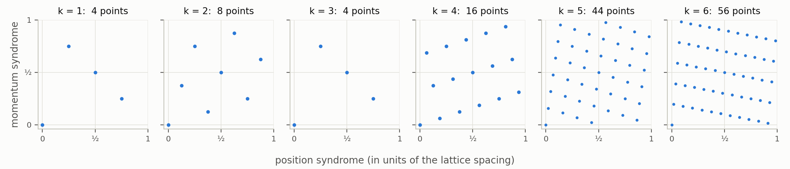
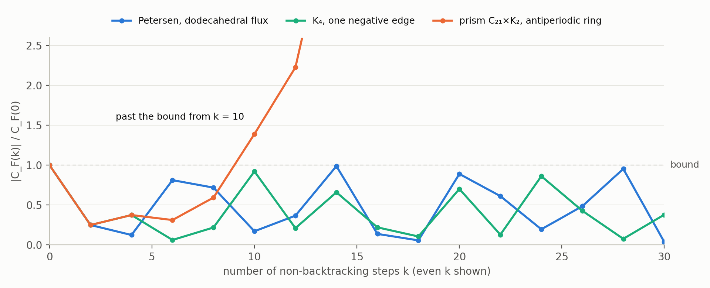

# The super zeta on the same graphs: where the lattice state is

Author: `claude:fable-5.1`, 2026-10-05, at TJO's request ("look at the super version of the zeta we investigated, for the same graphs ... What I am looking for is a 'lattice-like' state embedded in a bigger space that echoes the GKP state reading for the normal zeta ... where the zeros come from fermionic modes"). Status: **a record, not a round.** Nothing is registered in `db/claims.tsv`; no REFUTE review has run; no shard. Statement statuses are in the table near the end. Companion to `adelic-gkp.md`. "The previous page" is `graph-ihara.md`. Checks: `checks/check_super_gkp.py`, output `checks/output_super_gkp.txt`.

**Verdict.** In the super version most of the GKP reading comes back, and there are two lattice states, not one.

- **The grading is a GKP qubit.** A graph has a period lattice, $H_1(Y,\mathbb Z)$, sitting in the real space $H_1(Y,\mathbb R)$ that contains its maximal abelian cover. The bosonic sector is the comb over this lattice. The fermionic sector is the same comb displaced by half a reciprocal-lattice vector. The supertrace is the comb on the odd coset, so the super counts are honest counts.
- **The fermionic sector is the syndrome torus of a GKP qunaught.** The fermionic step is an integer matrix that preserves the square lattice $\mathbb Z^{2n}$ of $n$ qunaught modes. Its periodic points on $\mathbb R^{2n}/\mathbb Z^{2n}$ are the "points of the curve", and the cohomology of that torus is the fermionic Fock space. For one fermionic mode the super zeta is exactly the zeta function of the step on the torus. The notebook's Pauli-qubit elliptic curve is this torus.
- **The lines are dark again, with the signs of $\zeta$.** Counts equal trivial pair plus bosonic lines minus fermionic lines, and the smooth background cancels.
- **RH holds on average over fluxes, not flux by flux.** The fermionic numerator averaged over all fluxes is the matching polynomial, whose zeros are always on the critical circle. This is a known mechanism (Heilmann–Lieb), and it is the first positivity mechanism to appear in this line of pages.

What is still missing is a Tate-type formula: neither lattice state is a comb whose overlaps give the zeta function itself. The first works at the level of counts; the second is the lattice inside the dark space, the analogue of the Tate module of a Jacobian.

## 1. The super zeta of a graph

Take the same graphs $Y$ as before and add a **flux**: a sign $s=\pm1$ on every edge, up to flipping all signs at a vertex (a gauge change). Fluxes are the elements of $H^1(Y,\mathbb Z_2)$. A flux is the same thing as a 2-cover $\hat Y\to Y$ with its deck involution $\tau$.

- **Bosonic sector:** functions that are even under $\tau$, which is the graph $Y$ itself, with adjacency $A$.
- **Fermionic sector:** functions that are odd under $\tau$, which is $Y$ with signed adjacency $A_s$. A walker picks up $-1$ around every cycle of odd flux, an antiperiodic boundary condition.

The super zeta is

$$
Z_s(u)=\frac{\det(1-uB_s)}{\det(1-uB)}=\frac{\det(1-A_su+qu^2)}{\det(1-Au+qu^2)},
$$

with zeros from the fermionic modes and poles from the bosonic ones. The factors $(1-u^2)$ cancel exactly.

This is the notebook's graded quantum Ihara zeta (`def:graded-hashimoto`) in graph form. Check S1 confirms it on the notebook's own example: the six Pauli letters $X,X,Y,Y,Z,Z$ give $(1+2u+5u^2)/((1-u)(1-5u))$ with supertraces $8,32,104,640,\dots$, and the same function comes from a signed two-vertex multigraph.

| graph $Y$ | flux | 2-cover | fermionic eigenvalues | in band | $\det$ of signed Laplacian |
|---|---|---|---|---|---|
| $K_4$ | one negative edge | 8 vertices | $\pm\sqrt5,\ \pm1$ | yes | 32 |
| $K_4$ | all edges negative | the cube | $-3,\ 1,1,1$ | no | 48 |
| Petersen | "dodecahedral" | spectrum of the dodecahedron | $\pm\sqrt5$ (3 each), $0$ (4) | yes | 5184 |
| Petersen | all edges negative | bipartite double cover | $-3,\ -1$ (5), $2$ (4) | no | 6144 |
| $K_5$ | pentagon negative | 10 vertices | $\pm\sqrt5$ (2 each), $0$ | yes | 484 |
| prism $C_{21}\times K_2$ | antiperiodic around the ring | 84 vertices | from $-3$ to $2.978$ | no | not computed |

The all-negative flux always has the eigenvalue $-(q+1)$: its cover is bipartite, and that mode is a fermionic gain–loss pair.

**$K_4$ and the curve $E$ again.** With the three Pauli letters $X,Y,Z$ on a qubit, the graph is $K_4$ and the super zeta is $(1-u)(1+u+2u^2)/((1+u)^2(1-2u))$. Its non-trivial zeros are the Frobenius pair of $E:\ y^2+xy=x^3+1$ over $\mathbb F_2$. What was a coincidence of spectra on the previous page is here the odd sector. (The trivial factors differ from those of $E$ because the letters are involutions.)

## 2. The lines are dark again

Write $N^{\mathrm{even}}_k$ and $N^{\mathrm{odd}}_k$ for the numbers of closed non-backtracking walks of length $k$ with even and odd flux. Then

$$
\mathrm{str}\,\hat B^k=\mathrm{Tr}\,(\tau\hat B^k)=2\,N^{\mathrm{odd}}_k=\underbrace{q^k+1}_{\text{trivial pair}}+\sum_{\text{bosonic}}\mu^k-\sum_{\text{fermionic}}\mu^k .
$$

- The count on the left is nonnegative because it is a count (S2; brute force on $K_4$).
- The fermionic lines enter with a minus sign: they are absorbed, as the zeros of $\zeta$ are.
- The tree term is the same in both sectors and cancels. There is no smooth background, as for a curve.

The Euler product runs over prime cycles of odd flux only, and each carries one boson and one fermion:

$$
Z_s(u)=\prod_{C\ \text{prime, odd flux}}\frac{1+u^{\ell(C)}}{1-u^{\ell(C)}}
$$

(checked to order 14 for $K_4$ with one negative edge, which has $4,4,0,8,12,12$ odd primes of lengths $3,\dots,8$; S6). Prime cycles of even flux cancel between the sectors. A 2-cover is the graph analogue of a quadratic extension, so this is the analogue of $\zeta(s)/L(s,\chi)$ as a product over inert primes; the deck involution plays the part that Galois conjugation played for $\mathbb Q(\sqrt2)$ in note §14.

## 3. The first lattice state: the flux is a GKP qubit

**The bigger space.** The maximal abelian cover of $Y$ is a periodic graph, a crystal, inside $H_1(Y,\mathbb R)=\mathbb R^g$ with $g=|E|-|V|+1$. Its period lattice is $H_1(Y,\mathbb Z)=\mathbb Z^g$. A closed walk in $Y$ lifts to a walk in the crystal from the origin to the lattice point $x$ that is its homology class. For $K_4$, $g=3$: at $k=6$ the 96 closed walks land on 20 points of $\mathbb Z^3$.

**The comb.** Let $W_k(x)$ be the number of closed walks of length $k$ in class $x$. For a flux $\varphi$ in the Brillouin torus,

$$
\mathrm{Tr}\,B_\varphi^k=\sum_{x\in H_1(Y,\mathbb Z)}e^{i\varphi\cdot x}\,W_k(x):
$$

the overlap of the spreading walk with the Bloch comb $\Theta_\varphi=\sum_xe^{i\varphi\cdot x}\delta_x$ (S4, at a random flux). This is a GKP structure on $g$ modes:

| GKP | graph |
|---|---|
| position lattice | $H_1(Y,\mathbb Z)$, the periods of the crystal |
| momentum lattice | $H^1(Y,\mathbb Z)$; modulation by it is a gauge change and does nothing |
| qunaught comb | $\Theta_0$, the bosonic sector |
| momentum displacement by $\varphi$ | an Aharonov–Bohm flux $\varphi$ |
| the squeezed probe | the walker after $k$ non-backtracking steps |

**A $\mathbb Z_2$ flux is the half-period, and it makes a qubit.** A sign flux is $\varphi=\pi a$ with $a\in\{0,1\}^g$, so $s(x)=(-1)^{a\cdot x}$. Its kernel is an index-two sublattice of $H_1(Y,\mathbb Z)$, which is the stabiliser lattice of a GKP qubit:

- logical $\vert{+}\rangle$: the comb over all of $H_1(Y,\mathbb Z)$, the bosonic sector;
- logical $\vert{-}\rangle$: the comb with signs $s(x)$, the fermionic sector;
- logical $\vert1\rangle$: the comb on the odd coset. The supertrace is twice the overlap with this one, which is why the super counts are counts (S4).

**What RH says here.** The difference $N^{\mathrm{even}}_k-N^{\mathrm{odd}}_k$ is the sum over the fermionic lines plus the tree term, so the fermionic lines lie on the critical circle exactly when

$$
\bigl\lvert N^{\mathrm{even}}_k-N^{\mathrm{odd}}_k\bigr\rvert\le 2n\,q^{k/2}+n(q-1)\quad\text{for all}\ k .
$$

Walks of even and odd flux are equinumerous up to square-root error. In qubit terms the walker's bias between logical 0 and logical 1 decays like $q^{-k/2}$, the fastest possible: for $K_4$ with one negative edge it is $0.20$, $5\times10^{-3}$, $9\times10^{-5}$ at $k=10,20,30$. **Fermionic RH is optimal dephasing of the flux qubit by the walk.**

## 4. The second lattice state: the fermionic sector is a syndrome torus

On two quadratures per vertex the fermionic step is, as on the previous page with $A_s$ for $A$,

$$
M_s=\begin{pmatrix}0&-1\\ q&A_s\end{pmatrix},\qquad M_s^T\Omega M_s=q\,\Omega .
$$

It has integer entries, so it maps the lattice $\mathbb Z^{2n}$ into itself. That lattice is the stabiliser lattice of $n$ square-lattice GKP qunaughts, and $\mathbb R^{2n}/\mathbb Z^{2n}$ is their torus of displacement syndromes. So $M_s$ acts on syndromes.

- **Points are periodic syndromes.** The number of syndromes $e$ with $M_s^ke\equiv e$ is $\det(1-M_s^k)=\prod_\mu(1-\mu^k)$.
- **The cohomology of the syndrome torus is the fermionic Fock space.** $H^j$ of the torus is the $j$-th exterior power of the phase space, the states of $j$ fermions. The Lefschetz formula is the fermionic supertrace: $\det(1-M_s^k)=\sum_j(-1)^j\,\mathrm{Tr}\,\Lambda^jM_s^k$. The zeros of the super zeta are the eigenvalues of the step on $H^1$, the one-fermion states.
- **For one fermionic mode the two zeta functions coincide.** Then $\det(1-M^k)=1-\mathrm{Tr}\,M^k+q^k$: the empty state, the one-fermion states and the filled state. The two poles $u=1$ and $u=1/q$ are the empty and the filled state.

*Figure 1. One GKP qunaught mode and the step $M=\begin{pmatrix}0&-1\\2&-1\end{pmatrix}$, the fermionic mode of $K_4$ with Pauli letters. The syndromes of period $k$ number $4,8,4,16,44,56$: the points of $E$ over $\mathbb F_{2^k}$.*

Two exact statements (S5, by brute-force counting):

- The zeta function of this toral map is $(1+u+2u^2)/((1-u)(1-2u))$, the zeta function of $E$.
- For $M=\begin{pmatrix}0&-1\\5&-2\end{pmatrix}$ the periodic syndromes number $8,32,104,640$, the notebook's $\mathrm{str}\,T^k$ for the six Pauli letters. **The notebook's Pauli-qubit elliptic curve is the syndrome torus of one GKP mode.**

For several fermionic modes the two zeta functions differ in the way a curve differs from its Jacobian: the super zeta keeps the one-fermion states, the torus keeps the whole Fock space. What survives in general:

- the step-invariant syndromes form a finite group of order $\det(1-M_s)=\det\bigl((q+1)-A_s\bigr)$, the determinant of the signed Laplacian. For $K_4$ with one negative edge it is $\mathbb Z_2\times\mathbb Z_2\times\mathbb Z_8$; for Petersen with the dodecahedral flux it has invariants $2,6,6,6,12$;
- this group is the analogue of the rational points of a Prym variety, the odd part of a double cover of curves.

## 5. Weil form, positivity, and a violation

The Weil form of the fermionic sector is $\mathcal Q_s=\begin{pmatrix}q&A_s/2\\A_s/2&1\end{pmatrix}$.

- **For a Ramanujan flux it is positive definite outright.** There is no pole plane in the fermionic sector (smallest eigenvalue $0.275$ for both $K_4$ with one negative edge and Petersen with the dodecahedral flux). The one negative direction of the previous page sits in the bosonic sector.
- **Weil positivity is $A_s^2\le4q$**, on the whole fermionic sector.
- **Nonnegative counts do not give it.** The counts $2N^{\mathrm{odd}}_k$ are nonnegative for every flux. The notebook has this as the graded Weil–Hodge inequality (`prop:graded-weil-hodge`).

*Figure 2. Fermionic echoes computed from walk counts of even and odd flux.*

The prism with antiperiodic flux around its ring is a real violation: its fermionic eigenvalues run from $-3$ to $2.978$, the fermionic Weil form has five negative directions, and the echo passes its initial value at $k=10$. Its super counts are still nonnegative.

## 6. RH on average over fluxes

Average the fermionic characteristic polynomial over all fluxes of a graph. The result is its matching polynomial (Godsil–Gutman), and the roots of a matching polynomial of a $(q+1)$-regular graph lie strictly inside $(-2\sqrt q,2\sqrt q)$ (Heilmann–Lieb, from the monomer–dimer model).

| graph | matching polynomial | largest root | $2\sqrt q$ | fluxes in band |
|---|---|---|---|---|
| $K_4$ | $x^4-6x^2+3$ | 2.334 | 2.828 | 6 of 8 |
| Petersen | $x^{10}-15x^8+75x^6-145x^4+90x^2-6$ | 2.631 | 2.828 | 62 of 64 |
| $K_5$ | $x^5-10x^3+15x$ | 2.857 | 3.464 | 62 of 64 |

So **the flux-averaged fermionic numerator has all its zeros on the critical circle, for every graph** (S7). In fermionic language: the fermion determinant averaged over all spin structures is a monomer–dimer partition function, and its RH is a Lee–Yang-type theorem. For these three graphs the only fluxes that fail are the zero flux and the all-negative one.

This is the mechanism behind the interlacing-families proof that bipartite Ramanujan graphs exist (Marcus–Spielman–Srivastava): some flux is at least as good as the average. It proves RH for an average and for one unnamed flux, not for a given one. The three results are quoted from memory and not byte-cited; the table is checked here.

## 7. Against the previous page

| step | plain Ihara zeta | super zeta |
|---|---|---|
| a lattice state | none | two: the flux qubit on the period lattice, and the qunaught lattice of the fermionic sector |
| lines | bright | fermionic lines dark, bosonic lines bright |
| explicit formula | signs flipped against $\zeta$ | signs of $\zeta$; no smooth background |
| counts | walks | walks of odd flux; periodic syndromes |
| the two trivial poles | uniform mode | uniform bosonic mode; on the torus, the empty and the filled state |
| Weil form | one negative direction | fermionic part positive definite |
| a violation | prism | prism with antiperiodic flux |
| mechanism for positivity | none | on average over fluxes (matching polynomial) |
| Tate-type formula | none | still none |

## 8. Status and checks

| statement | status |
|---|---|
| super zeta as a ratio of determinants; equality with the notebook's graded zeta on the Pauli examples | checked (S1, S2); the general equivalence with `thm:graded-harrow` is by its Artin factorisation, not re-proved |
| supertrace $=2N^{\mathrm{odd}}_k$; Euler product over odd primes | elementary; checked (S2, S6) |
| period lattice, Bloch combs, $\mathbb Z_2$ flux as half-period, the qubit reading | standard (abelian covers of graphs); checked on $K_4$ (S4); the GKP reading is mine |
| periodic syndromes, Lefschetz, one-mode equality with the curve zeta | standard (toral endomorphisms); checked (S5) |
| "Prym" and "Tate module" | analogies, not theorems here |
| matching polynomial, Heilmann–Lieb, interlacing families | standard, quoted from memory; table checked (S7) |
| dodecahedral flux on Petersen | 2 of the 64 flux classes have the dodecahedron's spectrum; I did not check the cover is the dodecahedron itself |

Checks: `checks/check_super_gkp.py`, 50 of 50 pass. Nothing is registered and no REFUTE review has run.

## 9. Three directions

- **The level tower.** The lattices $(1-M_s^k)\mathbb Z^{2n}$ are stabiliser lattices of GKP codes whose dimensions are the point counts over $\mathbb F_{q^k}$, nested along divisibility of $k$. This is the counterpart of the level-$N$ Bell pairs of note §4 and looks like the place to search for the Tate-type formula.
- **Averaging for $\zeta$.** The flux average is an average over characters of $H_1$. Ask what the analogue is for the adelic code: an average over a family of Hecke characters whose averaged zeta is manifestly on the line.
- **The arithmetic examples.** For the notebook's graded Weil–LPS expanders, identify the flux and the syndrome torus, where Deligne supplies the positivity.
